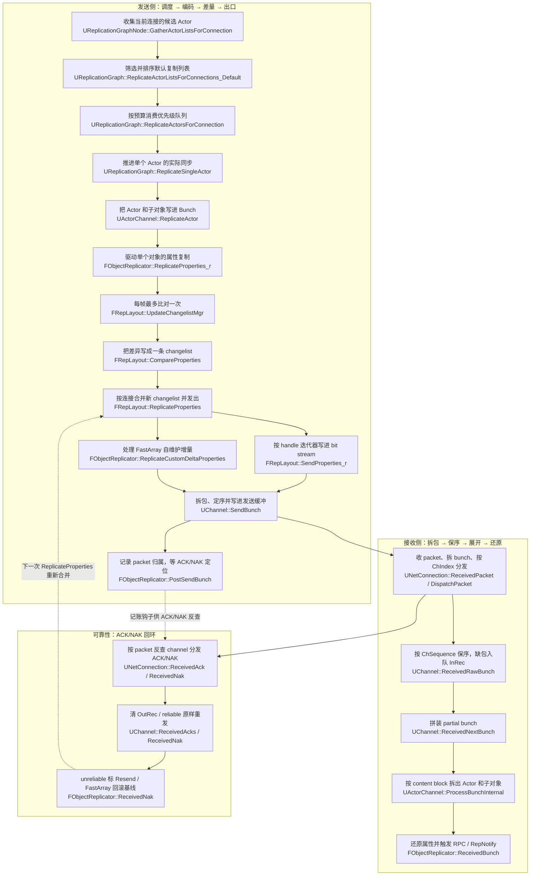
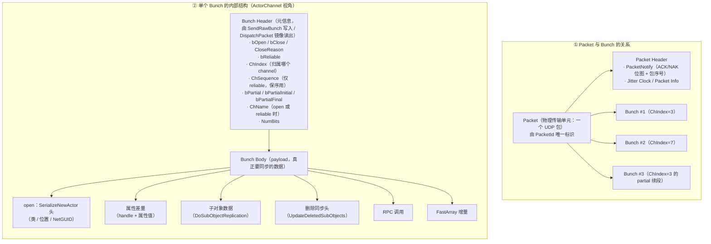
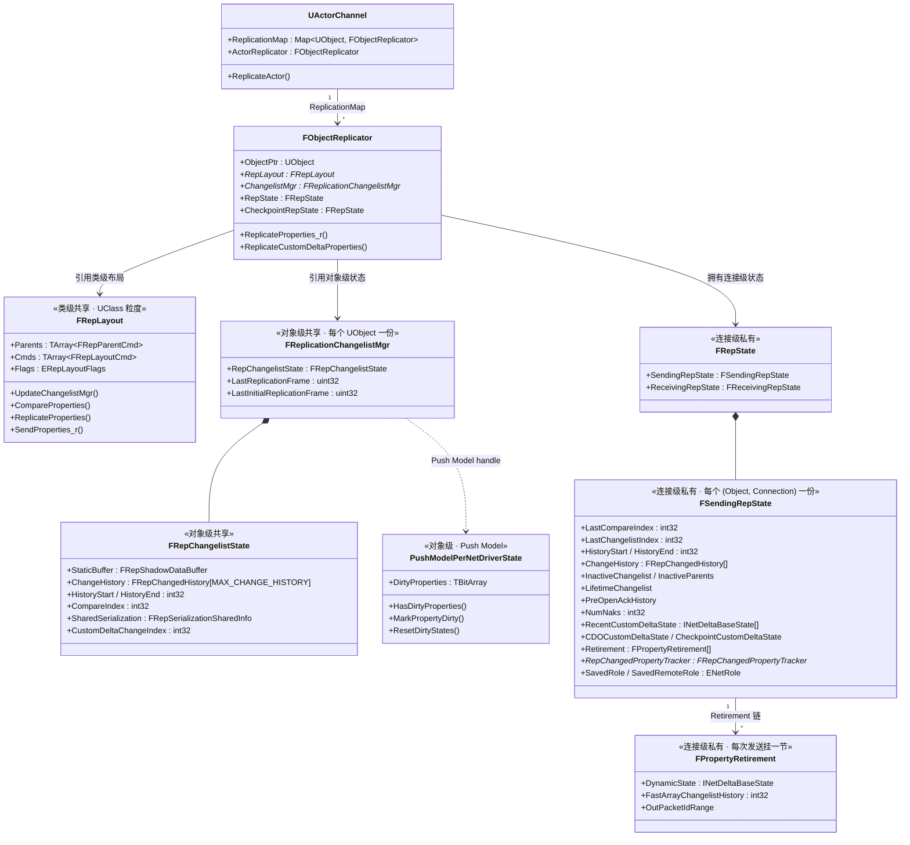

Actor 属性同步整体是一条「服务端比对差量 → 编码进 Bunch → 网络收发 → 客户端还原 → ACK/NAK 回环」的闭环。下面这张图把整条主线按「发送侧 → 接收侧 → 可靠性」三个阶段串起来，每个节点对应后文逐节展开的函数：




### `UReplicationGraphNode::GatherActorListsForConnection(...)` 收集当前连接的候选 Actor

```cpp
// 这一段还没有真正开始发 Actor，而是在为“当前连接这一帧可能关心谁”准备候选集合。
// 后面的默认复制和 FastShared 都不会回头遍历图节点，它们只消费这里收集出来的结果。
FGatheredReplicationActorLists GatheredReplicationListsForConnection;

// 先把当前连接这一帧的公共上下文打包好：viewer、可见关卡、帧号、输出容器都放进 Parameters。
// 后面的全局节点和连接私有节点都会围绕这一份输入工作，并把结果统一写回同一个 GatheredReplicationListsForConnection。
const FConnectionGatherActorListParameters Parameters(
	ConnectionViewers,
	*ConnectionManager,
	ConnectionManager->GetCachedClientVisibleLevelNames(),
	FrameNum,
	GatheredReplicationListsForConnection,
	bIsSelectedForHeavyComputation);

// 销毁同步不参与默认复制排序，但它也依赖本轮 gather 时看到的 viewer 状态，所以这里一起准备容器。
UNetReplicationGraphConnection::FRepGraphDestructionViewerInfoArray DestructionViewersInfo;

// 第一轮先跑全局节点，把“所有连接都可能共享”的候选 Actor 先写进结果表。
for (UReplicationGraphNode* Node : GlobalGraphNodes)
{
	Node->GatherActorListsForConnection(Parameters);
}

// 第二轮再跑当前连接私有的节点，把“只属于这个连接视角”的候选 Actor 补进同一份结果表。
// 走完这两轮之后，这个连接本帧的候选集合才算真正收齐。
for (UReplicationGraphNode* Node : ConnectionManager->ConnectionGraphNodes)
{
	Node->GatherActorListsForConnection(Parameters);
}

// 候选 Actor 收集完后，还要把本轮 gather 用过的 viewer 位置缓存下来。
// 后面的销毁同步、越界检查等逻辑会继续复用这些位置状态，所以 gather 不只是产出 Actor 列表，也会刷新连接侧的位置缓存。
ConnectionManager->UpdateGatherLocationsForConnection(ConnectionViewers, DestructionSettings);

// 如果一个列表都没有收集到，说明这个连接这一帧根本没有默认复制输入。
// 这种情况下直接跳过后面的默认复制阶段，避免继续做无意义的排序和发送。
if (GatheredReplicationListsForConnection.NumLists() == 0)
{
	continue;
}

// 默认复制接下来只会消费 GatheredReplicationListsForConnection；
// 但销毁同步还需要 viewer 的当前位置和上次越界检查位置，所以这里顺手把另一份输入也整理出来。
for (const FNetViewer& NetViewer : ConnectionViewers)
{
	FLastLocationGatherInfo* LastInfoForViewer =
		ConnectionManager->LastGatherLocations.FindByKey<UNetConnection*>(NetViewer.Connection);

	DestructionViewersInfo.Emplace(
		UNetReplicationGraphConnection::FRepGraphDestructionViewerInfo(
			NetViewer.ViewLocation,
			LastInfoForViewer->LastOutOfRangeLocationCheck));
}
```

这一段只负责给当前连接产出 `GatheredReplicationListsForConnection`。它本身不决定谁最终能发出去，只把各个图节点分散维护的候选列表汇总起来，交给后面的默认复制和 FastShared 继续处理。

### `UReplicationGraph::ReplicateActorListsForConnections_Default(...)` 筛选并排序默认复制列表

```cpp
// 这一段开始消费 Gather 阶段收集好的默认列表。
// 它不再负责“去哪里找 Actor”，而是把已有候选集合筛成一条真正的发送队列。
PrioritizedReplicationList.Reset();
TArray<FPrioritizedRepList::FItem>* SortingArray = &PrioritizedReplicationList.Items;

const TArrayView<const FActorRepListType> Actors =
	GatheredReplicationListsForConnection.ViewActors(EActorRepListTypeFlags::Default);

for (const FActorRepListType& Actor : Actors)
{
	// 先做最基础的合法性过滤。连复制前提都不满足的 Actor，到这里就直接淘汰，不再参与后面的状态查询和优先级计算。
	if (!ensureMsgf(IsActorValidForReplication_LogMoreInfo(Actor), TEXT("Actor not valid for replication")))
	{
		continue;
	}

	// 然后读取这个 Actor 在“当前连接视角”下的状态。
	// 这里面记录了 dormancy、上次复制帧、复制周期等信息，决定它这帧在这个连接上有没有资格继续往下走。
	FConnectionReplicationActorInfo& ConnectionData = ConnectionActorInfoMap.FindOrAdd(Actor);
	if (ConnectionData.bDormantOnConnection)
	{
		continue; // 当前连接上已经 dormant，连排序都不需要参加
	}

	// 再取全局状态。位置、优先级配置、ForceNetUpdate 等“跨连接共享”的信息都在这里。
	FGlobalActorReplicationInfo& GlobalData = GlobalActorReplicationInfoMap.Get(Actor);
	if (!ReadyForNextReplication(ConnectionData, GlobalData, FrameNum))
	{
		continue; // 当前连接上还没到它该复制的帧，直接留给后面的帧处理
	}

	// 走到这里，说明这个 Actor 至少通过了本帧的基础筛选，可以开始计算“它在这堆候选里应该排多靠前”。
	float AccumulatedPriority = GlobalData.Settings.AccumulatedNetPriorityBias;

	if (GlobalData.Settings.DistancePriorityScale > 0.f)
	{
		FVector::FReal SmallestDistanceSq = std::numeric_limits<FVector::FReal>::max();
		int32 ViewersThatSkipActor = 0;

		// 距离优先级要先看“当前连接的所有 viewer 里，谁离它最近”，同时统计是不是所有 viewer 都已经看不到它。
		// 只有没被所有 viewer 一起裁掉，它才值得继续参与本轮排序。
		for (const FNetViewer& CurViewer : Viewers)
		{
			const FVector::FReal DistSq = (GlobalData.WorldLocation - CurViewer.ViewLocation).SizeSquared();
			SmallestDistanceSq = FMath::Min(DistSq, SmallestDistanceSq);

			if (ConnectionData.GetCullDistanceSquared() > 0.f && DistSq > ConnectionData.GetCullDistanceSquared())
			{
				++ViewersThatSkipActor;
			}
		}

		if (ViewersThatSkipActor >= Viewers.Num())
		{
			continue; // 所有 viewer 都判定它太远，这个 Actor 本帧直接出局
		}

		// 没被距离裁掉时，再把最近距离折算成优先级因子：越远通常越靠后。
		const float DistanceFactor =
			FMath::Clamp(static_cast<float>(SmallestDistanceSq / PrioritizationConstants.MaxDistanceScaling), 0.f, 1.f)
			* GlobalData.Settings.DistancePriorityScale;
		AccumulatedPriority += DistanceFactor;
	}

	// 排序前先续一下 channel 的关闭超时。
	// 这样即使它这帧最后因为预算不够没真正发出去，也不会因为“正在排队中”而被过早回收 channel。
	UpdateActorChannelCloseFrameNum(Actor, ConnectionData, GlobalData, FrameNum, NetConnection);

	if (GlobalData.Settings.StarvationPriorityScale > 0.f)
	{
		// 距离上次真正复制越久，补偿越明显。
		// 这一层是在给“连续多帧没抢到预算”的 Actor 一个重新往前挤的机会。
		const float FramesSinceLastRep =
			static_cast<float>(FrameNum - ConnectionData.LastRepFrameNum)
			* GlobalData.Settings.StarvationPriorityScale;
		const float StarvationFactor =
			1.f - FMath::Clamp<float>(FramesSinceLastRep / (float)PrioritizationConstants.MaxFramesSinceLastRep, 0.f, 1.f);
		AccumulatedPriority += StarvationFactor;
	}

	// 下面几项都是在基础优先级上继续做“插队”修正：
	// 即将 dormancy 的 Actor 往前提，是为了尽快完成最后一轮同步并收口；
	// ForceNetUpdate 往前提，是为了尽快把游戏代码要求的最新状态送出去；
	// viewer / view target 则永远是当前连接最重要的对象。
	if (GlobalData.bWantsToBeDormant && ConnectionData.LastRepFrameNum > 0)
	{
		AccumulatedPriority -= 1.5f;
	}

	if (GlobalData.ForceNetUpdateFrame > ConnectionData.LastRepFrameNum)
	{
		AccumulatedPriority -= 1.f;
	}

	for (const FNetViewer& CurViewer : Viewers)
	{
		if (Actor == CurViewer.ViewTarget || Actor == CurViewer.InViewer)
		{
			AccumulatedPriority -= 10.0f;
			break;
		}
	}

	// 到这里，这个 Actor 已经完成了“能不能发”和“应该排第几”的判断。
	// 接下来把它连同连接态/全局态一起塞进排序数组，等待统一排序。
	SortingArray->Emplace(FPrioritizedRepList::FItem(AccumulatedPriority, Actor, &GlobalData, &ConnectionData));
}

// Gather 阶段给的是候选集合；这一步排序之后，才真正变成“本连接本帧应该按什么顺序发送”。
SortingArray->Sort();
ReplicateActorsForConnection(NetConnection, ConnectionActorInfoMap, ConnectionManager, FrameNum);
```

这一段决定的不是“有哪些 Actor 属于这个连接”，而是“Gather 出来的默认列表里，哪些 Actor 这帧能继续往下走，以及它们应该按什么顺序抢预算”。真正会进入网络包的是 `PrioritizedReplicationList` 前面的对象。需要留意的是这里的距离裁剪和优先级都是按“当前连接的 viewer 集合”算的，AlwaysRelevant Actor 也会走这条路径，但它们通常在 Gather 阶段就被放进单独的 always-relevant 节点里，`DistancePriorityScale` 设成 0 时 `AccumulatedPriority` 只受 starvation / ForceNetUpdate / viewer 加成影响，不会因为距离远被裁掉。

### `UReplicationGraph::ReplicateActorsForConnection(...)` 按预算消费优先级队列

```cpp
// 上一阶段已经把发送顺序排好了，这里不再重新算优先级。
// 当前函数做的事情很单纯：沿着排序结果往下走，看看在本帧预算耗尽前能真正发出去多少 Actor。
for (int32 ActorIdx = 0; ActorIdx < PrioritizedReplicationList.Items.Num(); ++ActorIdx)
{
	const FPrioritizedRepList::FItem& RepItem = PrioritizedReplicationList.Items[ActorIdx];

	AActor* Actor = RepItem.Actor;
	FConnectionReplicationActorInfo& ActorInfo = *RepItem.ConnectionData;

	// 同一个 Actor 可能从别的路径提前发过，所以真正进入单 Actor 复制前还要再做一次“本帧是否已发送”的去重检查。
	if (ActorInfo.LastRepFrameNum == FrameNum)
	{
		continue;
	}

	// 走到这里才真正进入单 Actor 处理：是否开 channel、是否做 PreReplication、是否进入 tear off / dormancy，都会在下一层完成。
	FGlobalActorReplicationInfo& GlobalActorInfo = *RepItem.GlobalData;
	ReplicateSingleActor(Actor, ActorInfo, GlobalActorInfo, ConnectionActorInfoMap, *ConnectionManager, FrameNum);

	// 每发完一个 Actor 都马上检查预算。
	// 一旦连接已经饱和，后面的 Actor 就不能继续硬发，而是转成 starved list，等后续帧再重新竞争发送机会。
	if (IsConnectionReady(NetConnection) == false)
	{
		HandleStarvedActorList(*ConnectionManager, PrioritizedReplicationList, ActorIdx + 1, ConnectionActorInfoMap, FrameNum);
		NotifyConnectionSaturated(*ConnectionManager);
		break;
	}
}
```

`ReplicateActorsForConnection(...)` 只是消费已经排好的队列，不再重新算优先级，只负责按顺序把 Actor 一个个送进 `ReplicateSingleActor(...)`，直到本帧连接预算耗尽。饱和之后剩余 Actor 会被 `HandleStarvedActorList(...)` 记入 starved 集合，starvation 补偿会让它们下一次拿到更高优先级——但这意味着 starved 队列越长，短时间内新 Actor 就越可能被挤到后面，所以“可靠传输 + 预算受限”的组合天然会放大高优先级 Actor 抖动的影响。

### `UReplicationGraph::ReplicateSingleActor(...)` 推进单个 Actor 的实际同步

```cpp
// 这一层已经离开“连接级调度”，开始处理单个 Actor 真正怎么发。
// 进来前先挡掉“空 Actor / channel 正在关闭 / channel 绑错了 Actor”这几类明显不应该继续的场景。
if (!Actor || !IsActorValidForReplication_LogMoreInfo(Actor)) { return 0; }
if (ActorInfo.Channel && (ActorInfo.Channel->Closing || ActorInfo.Channel->Actor != Actor)) { return 0; }

// 只有确认这次复制可以继续，才把连接侧时间状态推进到本帧。
// 这一步会影响后面 ReadyForNextReplication 的判断，所以它是“当前连接已经轮到这个 Actor 处理”的正式标记。
ActorInfo.LastRepFrameNum = FrameNum;
ActorInfo.NextReplicationFrameNum = FrameNum + ActorInfo.ReplicationPeriodFrame;

// 真正写数据前，先确保 PreReplication 在这一帧只执行一次。
// 这里按 Actor 的全局帧状态去重，而不是按连接去重，所以同一个 Actor 发给多个连接时不会重复准备同一份复制前状态。
if (GlobalActorInfo.LastPreReplicationFrame != FrameNum)
{
	GlobalActorInfo.LastPreReplicationFrame = FrameNum;
	Actor->CallPreReplication(NetDriver);
}

// 某些 Actor 在复制时需要临时交换 Role，这里在真正写出前搭好执行环境。
TOptional<FScopedActorRoleSwap> SwapGuard;
if (GlobalActorInfo.bSwapRolesOnReplicate)
{
	SwapGuard = FScopedActorRoleSwap(Actor);
}

// 走到这里开始处理当前连接上的承载通道：有 channel 就复用，没有就现场创建。
// Actor 到这一步才真正从“待发对象”变成“当前连接上有网络通道承载的复制对象”。
if (ActorInfo.Channel == nullptr)
{
	ActorInfo.Channel = (UActorChannel*)NetConnection->CreateChannelByName(NAME_Actor, EChannelCreateFlags::OpenedLocally);
	if (!ActorInfo.Channel) { return 0; }
	ActorInfo.Channel->SetChannelActor(Actor, ESetChannelActorFlags::None);
}

// 如果这一轮复制后准备进入 dormancy，就在真正写数据前先把 channel 切到“开始进入 dormant”的状态。
if (GlobalActorInfo.bWantsToBeDormant)
{
	ActorInfo.Channel->StartBecomingDormant();
}

int64 BitsWritten = 0;
if (ActorInfo.bTearOff)
{
	// tear off 路径的主线是：先发最后一次状态，再立刻关闭 channel。
	// 也就是说，这次复制既是最后一次同步，也是后续断开复制关系的收尾动作。
	BitsWritten = ActorInfo.Channel->ReplicateActor();
	BitsWritten += ActorInfo.Channel->Close(EChannelCloseReason::TearOff);
}
else
{
	// 普通路径把“真正写出这一帧 Actor 数据”的工作完整交给 UActorChannel。
	// ReplicationGraph 到这里的职责基本结束，下面进入的是 Channel 层的序列化逻辑。
	BitsWritten = ActorInfo.Channel->ReplicateActor();
}

// 主 Actor 发完并不代表这一条链结束。
// 如果它声明了 dependent actors，这里会把依赖 Actor 再收集出来，沿着同一条同步链继续往下推进。
FGatheredReplicationActorLists ListGatherer;
GlobalActorInfo.GatherDependentActorLists(ConnectionManager, ListGatherer);
const int32 CloseFrameNum = ActorInfo.ActorChannelCloseFrameNum;

for (AActor* DependentActor : ListGatherer.ViewActors(EActorRepListTypeFlags::Default))
{
	FConnectionReplicationActorInfo& DepInfo = ConnectionActorInfoMap.FindOrAdd(DependentActor);
	FGlobalActorReplicationInfo& DepGlobal = GlobalActorReplicationInfoMap.Get(DependentActor);

	// dependent actor 不会重新回到外层优先级队列里排队，而是直接继承主 Actor 这条执行链继续处理。
	// 所以先把它的 channel 关闭时机至少推到和主 Actor 一样靠后，避免主 Actor 还活着时依赖的 channel 先被超时回收。
	UpdateActorChannelCloseFrameNum(DependentActor, DepInfo, DepGlobal, FrameNum, NetConnection);
	DepInfo.ActorChannelCloseFrameNum = FMath::Max<uint32>(CloseFrameNum, DepInfo.ActorChannelCloseFrameNum);

	// 只有依赖 Actor 自己也满足本帧复制条件时，才会继续沿着这条链递归往下走。
	if (!ReadyForNextReplication(DepInfo, DepGlobal, FrameNum)) { continue; }
	if (!IsActorValidForReplication(DependentActor)) { continue; }

	BitsWritten += ReplicateSingleActor(DependentActor, DepInfo, DepGlobal, ConnectionActorInfoMap, ConnectionManager, FrameNum);
}
```

`ReplicateSingleActor(...)` 是从 ReplicationGraph 进入实际同步的边界，它负责推进当前连接上的复制时序、建立或复用 `UActorChannel`、处理 dormancy / tear off，并把真正的数据写出动作交给 `UActorChannel::ReplicateActor()`；dependent actors 沿着这条链继续递归下去，不会重新参加外层优先级排序。这里 dependent actor 的递归有个潜在陷阱：如果主 Actor 和 dependent 之间形成循环依赖，或者 dependent 数量非常多，会在同一次调用栈里一路展开，同时也会跳过外层 bandwidth 预算检查——因为预算判断只在 `ReplicateActorsForConnection(...)` 的外层循环里做，所以 dependent 越多，主 Actor “挤占”本帧预算的隐性放大就越明显。

### `UActorChannel::ReplicateActor()` 把 Actor 和子对象真正写进 Bunch

```cpp
// 走到这一层时，ReplicationGraph 已经替当前连接选好了“这帧该发谁”。
// 当前函数不再决定调度顺序，而是开始处理“这个 Actor 具体要怎么编码进当前 bunch”。
check(Actor); check(!Closing); check(Connection);

const UWorld* const ActorWorld = Actor->GetWorld();
if (ActorWorld == nullptr) { return 0; }

// 这一批早退条件覆盖“不该继续复制”的所有边界：
// dormancy hysteresis 未结束、递归重入、Actor 已 PendingKill、reliable 尚未 ACK、BeginPlay 前禁用等。
// 主线上真正关键的只有“任一命中就直接 return 0，不进入下面的序列化”。
if (bIsInDormancyHysteresis || bIsReplicatingActor || bActorIsPendingKill) { return 0; }
if (!IsValidChecked(Actor) || Actor->IsUnreachable()) { bActorIsPendingKill = true; ActorReplicator.Reset(); return 0; }
if (bPausedUntilReliableACK && NumOutRec > 0) { return 0; }

// 准备本次要写的 bunch。这一帧 Actor、组件、子对象写出的内容都会先进入这里。
FOutBunch Bunch(this, 0);
if (Bunch.IsError()) { return 0; }

FGuardValue_Bitfield(bIsReplicatingActor, true);
FScopedRepContext RepContext(Connection, Actor);
FReplicationFlags RepFlags;
bool bWroteSomethingImportant = false;

// 先确定这次是不是“初次打开 channel”或“重新补发初始状态”。
// 如果是初始路径，后面不仅要发属性，还要先把 NewActor 信息和初始状态头写进 bunch。
if (OpenPacketId.First != INDEX_NONE && Connection->ResendAllDataState == EResendAllDataState::None)
{
	if (!SpawnAcked && OpenAcked)
	{
		// spawn ack 回来后，让所有子对象的 replicator 强制重发一次不可靠属性，
		// 覆盖“打开阶段可能被丢弃的 unreliable 数据”这段窗口。
		SpawnAcked = 1;
		for (auto RepComp = ReplicationMap.CreateIterator(); RepComp; ++RepComp)
		{
			RepComp.Value()->ForceRefreshUnreliableProperties();
		}
	}
}
else
{
	// 走初始或补发路径：初始状态必须可靠，NetTemporary 直接 close。
	RepFlags.bNetInitial = true;
	Bunch.bClose = Actor->bNetTemporary;
	Bunch.bReliable = true;
}

// 判断本连接是不是这个 Actor 的 owner（含 splitscreen 子连接）。
UNetConnection* OwningConnection = Actor->GetNetConnection();
RepFlags.bNetOwner = (OwningConnection == Connection)
	|| (OwningConnection && OwningConnection->IsA(UChildConnection::StaticClass())
		&& ((UChildConnection*)OwningConnection)->Parent == Connection);

if (RepFlags.bNetInitial && OpenedLocally)
{
	// 这一步把“这是一个新 Actor / 新 channel”的元信息先写进 bunch。
	// 后面的属性复制是在这个基础上继续追加内容，而不是替代它。
	Connection->PackageMap->SerializeNewActor(Bunch, this, static_cast<AActor*&>(Actor));
	Actor->OnSerializeNewActor(Bunch);
	bWroteSomethingImportant = true;
	RepFlags.bForceInitialDirty = Bunch.bOutWantsFullInitState;
}

// 复制标志一次性准备好：simulated / physics / replay / owner。
// 后面 Actor 属性、组件、子对象复制都会复用这组标志，不会各自重新推断一遍。
RepFlags.bNetSimulated = (Actor->GetRemoteRole() == ROLE_SimulatedProxy)
	|| (Actor->GetRemoteRole() == ROLE_AutonomousProxy && Connection->IsProxyConnection());
RepFlags.bRepPhysics = Actor->GetReplicatedMovement().bRepPhysics;
RepFlags.bReplay = Connection->IsReplay();
RepFlags.bForceInitialDirty |= Connection->IsForceInitialDirty();

FMemMark MemMark(FMemStack::Get());

// 先复制 Actor 本体属性。CanSkipUpdate 允许某些帧完全跳过属性序列化，避免无变化时重复写包。
if (!ActorReplicator->CanSkipUpdate(RepFlags))
{
	bWroteSomethingImportant |= ActorReplicator->ReplicateProperties(Bunch, RepFlags);
}

// Actor 本体写完后，继续把组件 / 子对象追加到同一个 bunch。
// 这一层只是把对象树沿着当前 ActorChannel 展开，不会重新创建新的调度链。
bWroteSomethingImportant |= DoSubObjectReplication(Bunch, RepFlags);

// 普通路径下，Actor 和存活子对象都写完后，还要补一轮“删除同步”：
// 把已经失效、销毁或 tear off 的子对象删除头也写进当前 bunch。
bWroteSomethingImportant |= UpdateDeletedSubObjects(Bunch);

int64 NumBitsWrote = 0;
if (bWroteSomethingImportant)
{
	// 只有 bunch 里真的写进了重要内容，才会进入真正发送。
	// SendBunch 之后，PostSendBunch 会把本次发送对应的 packet range 回写给各个 replicator，供后续 ACK / NAK 和状态推进使用。
	FPacketIdRange PacketRange = SendBunch(&Bunch, 1);
	for (auto RepComp = ReplicationMap.CreateIterator(); RepComp; ++RepComp)
	{
		RepComp.Value()->PostSendBunch(PacketRange, Bunch.bReliable);
	}
	NumBitsWrote = Bunch.GetNumBits();
}

// 不管这一轮最终有没有真正写出属性，只要已经完整评估过当前 Actor，就更新 LastUpdateTime。
// 这样下一轮复制判断看到的是“这个 Actor 最近一次被评估的时间”，而不只是“最近一次真正写出数据的时间”。
LastUpdateTime = Connection->Driver->GetElapsedTime();
MemMark.Pop();
bForceCompareProperties = false;
return NumBitsWrote;
```

这一层开始，主线已经从 `ReplicationGraph` 的“挑谁发”切到 `UActorChannel` 的“怎么发”。`ReplicateSingleActor(...)` 负责把单个 Actor 推到 Channel 层，而 `UActorChannel::ReplicateActor()` 完成的是：准备 `Bunch`、写新建 Actor 头、写 Actor 属性、写子对象、补子对象删除信息、发送并在发送后推进 replicator 状态。`RepFlags` 的组装很关键——它是后面所有属性 / 子对象复制的共享上下文，`bNetOwner` / `bNetSimulated` 的值直接决定 conditional 属性会不会走过滤，因此这里的判断错一次会导致这条 Actor 在整个连接生命周期里都发错内容，属于比较难排查的一类 bug 场景。

### `UActorChannel::DoSubObjectReplication(...)` 沿着当前 ActorChannel 继续写子对象

```cpp
// Actor 本体属性写完后，接下来不是回到 ReplicationGraph，而是继续沿着当前 ActorChannel 往下展开子对象。
// 所以子对象复制和 Actor 本体复制共享同一个 bunch、同一组 RepFlags、同一套发送时机。
bool bWroteSomethingImportant = false;

if (Actor->IsUsingRegisteredSubObjectList())
{
	// 新路径下，Actor 和组件维护一份注册表，Channel 直接按注册表把应该复制的子对象写出去。
	bWroteSomethingImportant |= ReplicateRegisteredSubObjects(Bunch, OutRepFlags);
}
else
{
	// 旧路径下，则回调 Actor::ReplicateSubobjects(...)，由 Actor 自己决定把哪些子对象写进当前 bunch。
	bWroteSomethingImportant |= Actor->ReplicateSubobjects(this, &Bunch, &OutRepFlags);
}

// 子对象复制结束后，把当前 subobject owner 清空，避免后面的内容继续错误沿用上一轮子对象上下文。
AActor* TempNull(nullptr);
SetCurrentSubObjectOwner(TempNull);

return bWroteSomethingImportant;
```

这一层只是把 Actor 的对象树沿着同一个 `ActorChannel` 继续展开。无论子对象来自注册列表还是 `Actor::ReplicateSubobjects(...)`，它们都不是独立的发送单元，而是当前 Actor 这次复制的一部分。旧路径下要注意 `Actor::ReplicateSubobjects(...)` 里手动 `Channel->ReplicateSubobject(...)` 的写法：如果条件判断遗漏、或者子对象条件在两次调用之间发生变化，客户端会出现“组件存在但属性从未同步”的现象，新的注册表路径就是为了消除这种手写维护带来的差错。

### `UActorChannel::UpdateDeletedSubObjects(...)` 给失效子对象补删除同步

```cpp
// 普通复制路径下，活着的子对象写完还不够，还要补一轮“哪些子对象已经不该继续存在”。
// 这一层的目标不是发送状态，而是把删除 / 销毁 / tear off 这种生命周期变化也编码给客户端。
bool bWroteSomethingImportant = false;

auto DeleteSubObject = [&](FNetworkGUID NetGUID, const TWeakObjectPtr<UObject>& ObjPtr, ESubObjectDeleteFlag Flag)
{
	if (NetGUID.IsValid())
	{
		WriteContentBlockForSubObjectDelete(Bunch, NetGUID, Flag); // 先写删除头，告诉客户端这个子对象应该结束生命周期
		bWroteSomethingImportant = true;
		Bunch.bReliable = true; // 删除同步必须可靠送达，否则客户端会残留脏对象
	}
};

// 先处理“网络对象系统已经明确判定失效”的子对象引用：
// 这一步不仅会写删除头，还会把对应 replicator 立刻清理掉，避免后面继续尝试为它复制属性。
if (InvalidSubObjects.HasInvalidSubObjects() && ChannelSubObjectDirtyCount != InvalidSubObjects.GetDirtyCount())
{
	for (const FNetworkObjectList::FSubObjectChannelReference& Ref : InvalidSubObjects.GetInvalidSubObjects())
	{
		if (UObject* ObjectToRemove = Ref.SubObjectPtr.GetEvenIfUnreachable())
		{
			if (TSharedRef<FObjectReplicator>* Rep = ReplicationMap.Find(ObjectToRemove))
			{
				const ESubObjectDeleteFlag Flag = Ref.IsTearOff() ? ESubObjectDeleteFlag::TearOff : ESubObjectDeleteFlag::ForceDelete;
				DeleteSubObject((*Rep)->ObjectNetGUID, Ref.SubObjectPtr, Flag);
				(*Rep)->CleanUp();
				ReplicationMap.Remove(ObjectToRemove);
			}
		}
	}
}

// 然后再扫一遍当前 replication map，把这轮复制过程中已经失效（WeakObjPtr 悬空）的子对象也补上 Destroyed 删除头。
for (auto RepComp = ReplicationMap.CreateIterator(); RepComp; ++RepComp)
{
	TSharedRef<FObjectReplicator>& Rep = RepComp.Value();
	if (!Rep->GetWeakObjectPtr().IsValid())
	{
		DeleteSubObject(Rep->ObjectNetGUID, Rep->GetWeakObjectPtr(), ESubObjectDeleteFlag::Destroyed);
		Rep->CleanUp();
		RepComp.RemoveCurrent();
	}
}

return bWroteSomethingImportant;
```

这一段补的是“对象树里谁该消失”，而不是“对象树里谁该更新”。所以 `UActorChannel::ReplicateActor()` 的完整路径并不是只写存活对象的属性，它还会在同一个 `Bunch` 里补上子对象删除头，把客户端那边的对象生命周期一起推进到正确状态。删除同步强制走 reliable，意味着一旦某个客户端网络卡顿，这段可靠数据会占用可靠窗口——如果同一帧有大量子对象一起消失（例如 destroy 一个含有大量组件的 Actor），会看到 reliable buffer 快速填满的现象。

### `FObjectReplicator::ReplicateProperties_r(...)` 驱动单个对象的属性复制

```cpp
UObject* Object = GetObject();
if (Object == nullptr) { return false; }

// 每个 replicator 都要拿到发送侧的 RepState 才能继续。
// 这一路径上共有三份状态：
//   - RepLayout：类级别，描述这个类的所有可复制属性 / 命令树 / 条件；
//   - RepChangelistState：对象级别，记录“对象最近有哪些属性和影子副本不一致”，跨连接共享；
//   - SendingRepState：连接级别，记录“这个连接上已经发到 changelist 的哪一条历史”。
FSendingRepState* SendingRepState = RepState->GetSendingRepState();

// 真正写数据前，先跑一次“比对”阶段。
// 这一步不写 bunch，只把当前对象内存和影子副本对比出来的差异存进 RepChangelistState 的 history。
// 由于是对象级共享的，同一帧后面别的连接再来复制时可以直接复用这次比对结果，不用重复扫属性。
const ERepLayoutResult UpdateResult = FNetSerializeCB::UpdateChangelistMgr(
	*RepLayout, SendingRepState, *ChangelistMgr,
	Object, Connection->Driver->ReplicationFrame, RepFlags,
	OwningChannel->bForceCompareProperties);

if (UNLIKELY(ERepLayoutResult::FatalError == UpdateResult))
{
	Connection->SetPendingCloseDueToReplicationFailure();
	return false;
}

// 比对完成后，才真正把这一帧要发的属性数据写进 Writer。
// RepLayout 内部会读取 SendingRepState 上次发到哪一条 changelist，把之后所有新增 changelist 合并起来一次性写出。
const bool bHasRepLayout = RepLayout->ReplicateProperties(
	SendingRepState, ChangelistMgr->GetRepChangelistState(),
	(uint8*)Object, ObjectClass, OwningChannel, Writer, RepFlags);

// 常规属性走完 RepLayout；FastArray 之类需要“自定义增量”的属性走单独一条路径。
// 它不共享上面 RepChangelistState 的 history，而是每个 replicator 自己维护一份 delta 状态。
bool bSkippedPropertyCondition = false;
ReplicateCustomDeltaProperties(Writer, RepFlags, bSkippedPropertyCondition);
```

到这一层，属性复制才真正开始：先由 `UpdateChangelistMgr(...)` 保证“比对结果对本帧可用”，再由 `RepLayout->ReplicateProperties(...)` 把当前连接还没发出去的差量拼进 `Writer`，最后 `ReplicateCustomDeltaProperties(...)` 补上 FastArray 等自定义增量属性。产出的字节最终会回到上一层 `UActorChannel::ReplicateActor()` 的同一个 `Bunch` 里发出去。这里 `RepState` 是每 `(Object, Connection)` 各持有一份，也就是同一个 Actor 对着 N 个连接会有 N 份独立的发送态；发送态本身不大，但 property tracker / inactive list / retirement 链会随着连接数线性增长——这也是为什么大量玩家共同关注的 Actor（例如全局状态类）容易在 profiler 里看到 `FObjectReplicator` 数量激增。

### `FRepLayout::UpdateChangelistMgr(...)` 每帧最多比对一次

```cpp
// 这一层控制的是“要不要重新比对”，而不是“怎么比对”。
// 因为 RepChangelistState 是对象级共享的，同一帧内多个连接来复制同一个对象时，只需要真正比对一次。
ERepLayoutResult Result = ERepLayoutResult::Success;

// 条件 1：这一帧已经比对过；
// 条件 2：如果这次是初次复制（bNetInitial），至少也要保证初次比对是在这一帧做的。
// 满足条件时就可以复用之前那一轮的比对结果，直接返回。
if (!bForceCompare && GShareShadowState
	&& (InChangelistMgr.LastReplicationFrame == ReplicationFrame)
	&& (!RepFlags.bNetInitial || (InChangelistMgr.LastInitialReplicationFrame == ReplicationFrame)))
{
	// 例外：Role / RemoteRole 是按连接“下调”的（downgrade），
	// 所以初次复制或者这个连接从来没比对过时，还是要额外做一次“只比对 Role”的补偿。
	if (RepFlags.bNetInitial || (RepState->LastCompareIndex == 0))
	{
		FReplicationFlags TempFlags = RepFlags;
		TempFlags.bRolesOnly = true;
		Result = CompareProperties(RepState, &InChangelistMgr.RepChangelistState,
			(const uint8*)InObject, TempFlags, bForceCompare);
	}
	return Result;
}

// 真正需要比对时，进入 CompareProperties：
// 它会遍历这个对象的所有可复制属性，把当前内存和 shadow buffer 对比出来的差异写成一条 changelist history。
Result = CompareProperties(RepState, &InChangelistMgr.RepChangelistState,
	(const uint8*)InObject, RepFlags, bForceCompare);

if (LIKELY(ERepLayoutResult::FatalError != Result))
{
	// 记录本次比对发生的帧号，供上面的“同一帧跳过重复比对”条件判断使用。
	InChangelistMgr.LastReplicationFrame = ReplicationFrame;
	if (RepFlags.bNetInitial)
	{
		InChangelistMgr.LastInitialReplicationFrame = ReplicationFrame;
	}
}
return Result;
```

`UpdateChangelistMgr(...)` 是一层节流：无论有多少连接同一帧都要复制同一个 Actor，真正扫属性的工作只会做一次。它保证的是“**每帧每对象最多一次全量比对**”，比对产出的 changelist 直接写进对象级共享的 `RepChangelistState`，后面各个连接的发送阶段只是消费这份共享结果。共享的代价是：一旦某个连接是本帧第一个走到这里的，它触发的比对会决定影子副本 / changelist 的形状，其它连接只能吃这个结果——所以“同一 Actor 对不同连接使用不同 RepCondition”这种玩法要靠 `RepChangedPropertyTracker` 和 `bRolesOnly` 补偿路径来把连接维度的差异塞回来，而不是重新比对。

### `FRepLayout::CompareProperties(...)` 把差异写成一条 changelist

```cpp
// 每进来一次都递增 CompareIndex，SendingRepState 用它判断“上次我发到哪个比对版本”。
RepChangelistState->CompareIndex++;

// history 是一个环形数组，容量 MAX_CHANGE_HISTORY；
// 每次比对产生一条新 history 项，写到 HistoryEnd 位置。
const int32 HistoryIndex = RepChangelistState->HistoryEnd % FRepChangelistState::MAX_CHANGE_HISTORY;
FRepChangedHistory& NewHistoryItem = RepChangelistState->ChangeHistory[HistoryIndex];
TArray<uint16>& Changed = NewHistoryItem.Changed;
Changed.Empty(1);

FComparePropertiesSharedParams SharedParams
{
	// 初次复制会强制“所有可复制属性都视为脏”，保证客户端拿到完整初始状态。
	.bIsInitial   = !!RepFlags.bNetInitial,
	.bForceFail   = !!RepFlags.bNetInitial && !!RepFlags.bForceInitialDirty,
	.Flags        = Flags,
	.Parents      = Parents,
	.Cmds         = Cmds,
	.RepState     = RepState,
	.RepChangelistState        = RepChangelistState,
	.RepChangedPropertyTracker = RepState ? RepState->RepChangedPropertyTracker.Get() : nullptr,
	.PushModelState            = UE_RepLayout_Private::GetPerNetDriverState(RepChangelistState),
	.bForceCompareProperties   = bForceCompare
};

FComparePropertiesStackParams StackParams
{
	.Data       = Data,                                                   // 当前对象真实内存
	.ShadowData = RepChangelistState->StaticBuffer.GetData(),             // 上次比对后保存的影子副本
	.Changed    = Changed,                                                // 输出：这次发现的差异（handle 序列）
	.Result     = Result
};

if (RepFlags.bRolesOnly)
{
	// 只比对 Role / RemoteRole 的补偿路径。
	CompareRoleProperties(SharedParams, StackParams);
}
else
{
	// 主路径：递归遍历所有 Parent 属性，逐个比对内存和 shadow buffer。
	// 每个真正“变了”的属性都会把它的 handle 追加进 Changed，同时把当前值写回 shadow buffer。
	CompareParentProperties(SharedParams, StackParams);
}

if (Changed.Num() == 0)
{
	// 本轮没有任何属性变化：不推进 history，让 SendingRepState 继续等下一次真正的变化。
	return ERepLayoutResult::Empty;
}

// 有差异时才把这一条 history 落定：尾部加一个 0 作为终止符，然后推进 HistoryEnd。
Changed.Add(0);
RepChangelistState->HistoryEnd++;

// 新一条 changelist 之后，之前基于旧数据算好的共享序列化结果就作废了。
RepChangelistState->SharedSerialization.Reset();

// 如果 history 环已经满了，就把最旧的一条合并到下一条里，保证还能腾出一格给下一次比对。
// 这样做的代价是：太久没连上的连接可能只能拿到“合并过的粗糙 changelist”，但不会丢失属性变化本身。
if ((RepChangelistState->HistoryEnd - RepChangelistState->HistoryStart) == FRepChangelistState::MAX_CHANGE_HISTORY)
{
	const int32 First  = RepChangelistState->HistoryStart++ % FRepChangelistState::MAX_CHANGE_HISTORY;
	const int32 Second = RepChangelistState->HistoryStart   % FRepChangelistState::MAX_CHANGE_HISTORY;
	TArray<uint16> SecondCopy = MoveTemp(RepChangelistState->ChangeHistory[Second].Changed);
	MergeChangeList(Data, RepChangelistState->ChangeHistory[First].Changed, SecondCopy,
		RepChangelistState->ChangeHistory[Second].Changed);
}
```

真正“找差异”的动作发生在 `CompareParentProperties(...)`：它比对当前对象内存和 `RepChangelistState->StaticBuffer`（**影子副本**）里保存的上一版本，只把变化的属性 handle 收集进 `Changed`。所以初次同步和增量同步在这里其实是同一条路径，区别只在于 `bIsInitial / bForceFail`：初次复制会强制把所有可复制属性都视为“变了”，一次性写进 changelist；后续同步则只会把真正与影子副本不一致的属性写进去。history 环形数组的容量决定了“最慢的连接”能追多久：如果某个连接一直没消费到，环回卷时会用 `MergeChangeList(...)` 把两条 history 并起来，属性不会丢，但客户端会看到“一次收到很多帧堆积后的合并结果”，视觉上表现为跳变。

### `FRepLayout::ReplicateProperties(...)` 按连接把新 changelist 合并并发出

```cpp
FRepChangedPropertyTracker* ChangeTracker = RepState->RepChangedPropertyTracker.Get();
TArray<uint16> NewlyActiveChangelist;

// 条件变化时（例如这次是 owner，上次不是），要重新算这个连接的可发送属性集合。
// InactiveChangelist 里“现在重新激活”的属性单独拿出来，后面作为 NewlyActiveChangelist 合并进本次要发的 changelist。
if (RepState->RepFlags.Value != RepFlags.Value)
{
	RebuildConditionalProperties(RepState, RepFlags);
	TArray<uint16> InactiveChangelist = MoveTemp(RepState->InactiveChangelist);
	TArray<uint16> NewInactiveChangeList;
	FilterChangeList(InactiveChangelist, RepState->InactiveParents,
		NewInactiveChangeList, NewlyActiveChangelist);
	RepState->InactiveChangelist = MoveTemp(NewInactiveChangeList);
}

// 走到这里之前，SendingRepState 上有两个关键坐标：
//   - LastCompareIndex：上次这个连接看到过的 CompareIndex；
//   - LastChangelistIndex：上次这个连接发到了 RepChangelistState 的哪一条 history。
// 如果对象这一帧没变（CompareIndex 没变），也没有 NAK / 未 ack 历史，那这个连接这一次就不需要发。
const bool bCompareIndexSame = RepState->LastCompareIndex == RepChangelistState->CompareIndex;
RepState->LastCompareIndex = RepChangelistState->CompareIndex;
if (bCompareIndexSame || RepState->LastChangelistIndex == RepChangelistState->HistoryEnd)
{
	if (RepState->NumNaks == 0 && NewlyActiveChangelist.Num() == 0)
	{
		UpdateChangelistHistory(RepState, ObjectClass, Data, OwningChannel->Connection, nullptr);
		return false; // 这个连接这一轮什么都不需要发
	}
}

// 增量同步的核心：从 SendingRepState 上次发到的位置开始，
// 把 RepChangelistState 里 [LastChangelistIndex, HistoryEnd) 之间所有 history 依次合并成一条最终 changelist。
// 这样即使中间隔了好几次比对，最终发出去的仍然是“上次发送以来发生过变化的属性并集”。
TArray<uint16>& Changed = PossibleNewHistoryItem.Changed;
for (int32 i = RepState->LastChangelistIndex; i < RepChangelistState->HistoryEnd; ++i)
{
	FRepChangedHistory& HistoryItem =
		RepChangelistState->ChangeHistory[i % FRepChangelistState::MAX_CHANGE_HISTORY];
	TArray<uint16> Temp = MoveTemp(Changed);
	MergeChangeList(Data, HistoryItem.Changed, Temp, Changed);
}

// 重新激活的属性也一并合进来，保证客户端能重新看到这些字段。
if (NewlyActiveChangelist.Num() > 0)
{
	TArray<uint16> Temp = MoveTemp(Changed);
	MergeChangeList(Data, NewlyActiveChangelist, Temp, Changed);
}

// 追上到最新的 history 位置，同时给这个连接自己也存一条 history，用于 NAK 时补发。
RepState->LastChangelistIndex = RepChangelistState->HistoryEnd;
if (Changed.Num() > 0 || RepState->NumNaks > 0)
{
	RepState->HistoryEnd++;
	UpdateChangelistHistory(RepState, ObjectClass, Data, OwningChannel->Connection, &Changed);
}

// 把最终 changelist 拆成 Active / Inactive 两份：
// 只有 Active 部分真的写进 Writer；Inactive 记回 InactiveChangelist，等条件重新满足时再发。
TArray<uint16> UnfilteredChanged = MoveTemp(Changed);
TArray<uint16> NewlyInactiveChangelist;
FilterChangeList(UnfilteredChanged, RepState->InactiveParents, NewlyInactiveChangelist, Changed);

if (Changed.Num() > 0)
{
	SendProperties(RepState, ChangeTracker, Data, ObjectClass, Writer, Changed,
		RepChangelistState->SharedSerialization,
		RepFlags.bSerializePropertyNames ? ESerializePropertyType::Name : ESerializePropertyType::Handle);
}
```

`FRepLayout::ReplicateProperties(...)` 是把“对象级共享的 changelist history”翻译成“这个连接这一帧真正要发的差量”的地方。它顺着 `SendingRepState->LastChangelistIndex` 到 `RepChangelistState->HistoryEnd`，把中间所有 history 合并成一条 `Changed`，再套上 conditional 过滤后交给 `SendProperties(...)`；初次同步、日常增量、条件重新激活、NAK 重传最终都收敛到这份合并后的 `Changed` 上。需要留意的是 `MergeChangeList(...)` 是纯 handle 级 union，不读当前值和历史值做“抵消”，所以 `A→B→A` 是否会漏同步取决于每次改动是否被至少比对到一次：非 Push Model 或每次修改都 `MARK_PROPERTY_DIRTY` 时两次比对都会命中 `!PropertiesAreIdentical` 并 `StoreProperty` 到影子副本，两次的 handle 都会保留在 `Changed` 里（代价是数值回到原点也会发一次），而 Push Model 下若中间某次修改绕过 setter 直接改内存、没打脏位，`CompareParentPropertyHelper` 就不会被触发，影子副本停留在上一次比对的值，之后再改回原值反而会被判成“没变”，这才是真正会漏同步的边界。

### `CompareParentProperties(...)` 决定哪些 Parent 属性真的要比对

```cpp
// 这一层只解决“哪些 parent 需要走详细比对”，真正的字段级 diff 在 CompareParentPropertyHelper 里。
// 全部决策的输入是 SharedParams：Parents/Cmds 是类级布局，PushModelState/PushModelProperties 是对象级脏标记，
// RepChangedPropertyTracker 则是连接侧的条件跟踪，共同决定这一帧要不要碰某个 parent。
check(StackParams.ShadowData);

#if WITH_PUSH_MODEL
if (SharedParams.PushModelState != nullptr)
{
	const bool bRecentlyCollectedGarbage = SharedParams.PushModelState->DidRecentlyCollectGarbage();

	// Actor 从 dormant 唤醒后，SendingRepState 里保存的 Role/RemoteRole 会失效。
	// 这里在“初次复制”或“Net Owner 状态变了”的情况下，强制把 Role / RemoteRole 标脏。
	if (UNLIKELY(EnumHasAnyFlags(SharedParams.Flags, ERepLayoutFlags::IsActor)
				&& (SharedParams.bIsInitial || SharedParams.bChangedNetOwner)))
	{
		SharedParams.PushModelState->MarkPropertyDirty((int32)AActor::ENetFields_Private::RemoteRole);
		SharedParams.PushModelState->MarkPropertyDirty((int32)AActor::ENetFields_Private::Role);
	}

	if (UNLIKELY(SharedParams.bForceFail))
	{
		// bForceFail 只有初次复制 + bForceInitialDirty 才会命中，
		// 这一支等价于“忽略所有脏标记，把每个 parent 都当成脏来比对”，用来强制补齐一份完整初始状态。
		for (int32 ParentIndex = 0; ParentIndex < SharedParams.Parents.Num(); ++ParentIndex)
		{
			CompareParentPropertyHelper(ParentIndex, SharedParams, StackParams);
		}
	}
	else if (UNLIKELY(SharedParams.bIsInitial
		&& EnumHasAnyFlags(SharedParams.Flags, ERepLayoutFlags::HasInitialOnlyProperties | ERepLayoutFlags::HasDynamicConditionProperties)))
	{
		// 这一支处理 COND_InitialOnly / COND_Dynamic == InitialOnly：
		// 由于一次“对象级比对”会被所有连接共享，如果不额外照顾 InitialOnly，
		// 后加入的连接看不到已经清掉脏标记的初始属性，所以每次 bNetInitial 都要重新比一遍它们。
		for (int32 ParentIndex = 0; ParentIndex < SharedParams.Parents.Num(); ++ParentIndex)
		{
			const ELifetimeCondition Condition = SharedParams.Parents[ParentIndex].Condition;
			if (Condition == COND_InitialOnly
				|| IsPropertyDirty(ParentIndex, bRecentlyCollectedGarbage, SharedParams, StackParams)
				|| (Condition == COND_Dynamic
					&& SharedParams.RepChangedPropertyTracker
					&& SharedParams.RepChangedPropertyTracker->GetDynamicCondition(ParentIndex) == COND_InitialOnly))
			{
				CompareParentPropertyHelper(ParentIndex, SharedParams, StackParams);
			}
		}
	}
	else if (EnumHasAnyFlags(SharedParams.Flags, ERepLayoutFlags::FullPushProperties) && !bRecentlyCollectedGarbage)
	{
		// 完全 Push Model 的类：脏位就是发送依据，没有脏位的属性直接跳过 diff。
		for (TConstSetBitIterator<> It = SharedParams.PushModelState->GetDirtyProperties(); It; ++It)
		{
			CompareParentPropertyHelper(It.GetIndex(), SharedParams, StackParams);
		}
	}
	else
	{
		// 混合场景：先用 Push Model 的脏位做一次筛选，
		// 只有 IsPropertyDirty 判定“可能变”的 parent 才走真正的内存对比。
		for (int32 ParentIndex = 0; ParentIndex < SharedParams.Parents.Num(); ++ParentIndex)
		{
			if (IsPropertyDirty(ParentIndex, bRecentlyCollectedGarbage, SharedParams, StackParams))
			{
				CompareParentPropertyHelper(ParentIndex, SharedParams, StackParams);
			}
		}
	}

	// 这一帧的脏位既然已经消费完，就在这里统一清空，避免下一帧误把旧脏位当成新变化。
	SharedParams.PushModelState->ResetDirtyStates();
	return;
}
#endif

// 关闭 Push Model 时退化成最保守的路径：所有 parent 都逐一走真实内存对比。
for (int32 ParentIndex = 0; ParentIndex < SharedParams.Parents.Num(); ++ParentIndex)
{
	CompareParentPropertyHelper(ParentIndex, SharedParams, StackParams);
}
```

`CompareParentProperties(...)` 只做“**跳过哪些 parent**”的选择，真正的字段级 diff 都收敛到 `CompareParentPropertyHelper` → `CompareProperties_r` → `Cmd.Property->NetSerializeItem` 那条链里去比对内存和 `RepChangelistState->StaticBuffer` 的影子副本。Push Model 是这里唯一的“加速器”：它把“**这个对象哪些 parent 可能变了**”从每帧全量扫描降到只扫脏位，一旦这一轮消费完，`ResetDirtyStates()` 会立刻清空脏位，等下一次 `MarkPropertyDirty(...)` 重新累计。这里的一个易错点是 `bRecentlyCollectedGarbage`：GC 之后如果属性里包含 `HasObjectProperties` 或 `IsNetSerialize`，即便没打脏位也会被强制比对，所以 GC 帧的 diff 开销会突然升高，profile 时若看到 `CompareParentPropertyHelper` 在 GC 后突然出现峰值，通常就是这条路径。

### `FRepLayout::SendProperties_r(...)` 按 handle 迭代器把 Changed 写进 bit stream

```cpp
// 这一层的输入是一份已经合并好的 Changed handle 序列（来自 ReplicateProperties 的最终 changelist），
// 输出是往 FNetBitWriter 里追加的 handle + 属性值序列化数据。
// 结构化上有两个关键角色：FRepHandleIterator 负责按顺序发出 handle，SharedInfo 提供跨连接共享的比特串。
const bool bDoSharedSerialization = SharedInfo && !!GNetSharedSerializedData;

while (HandleIterator.NextHandle())
{
	const FRepLayoutCmd& Cmd = Cmds[HandleIterator.CmdIndex];

	// SourceData 是对象根内存，(SourceData + Cmd) 把偏移套到 Cmd 对应字段，
	// 加上 ArrayOffset 之后就是当前 handle 对应的具体字段地址。
	FConstRepObjectDataBuffer Data = (SourceData + Cmd) + HandleIterator.ArrayOffset;

	if (Cmd.Type == ERepLayoutCmdType::DynamicArray)
	{
		// 动态数组要单独走一遍：先写 handle 头，再写数组长度，然后递归发数组内的子 handle。
		WritePropertyHandle(Writer, HandleIterator.Handle, bDoChecksum);
		const FScriptArray* Array = (FScriptArray*)Data.Data;
		uint16 ArrayNum = Array->Num();
		Writer << ArrayNum;

		// Changed 里数组的编码结构是 [handle, ArrayChangedCount, 子handle..., 0]。
		HandleIterator.ChangelistIterator.ChangedIndex++;
		TArray<FHandleToCmdIndex>& ArrayHandleToCmdIndex = *HandleIterator.HandleToCmdIndex[Cmd.RelativeHandle - 1].HandleToCmdIndex;
		FRepHandleIterator ArrayHandleIterator(HandleIterator.Owner, HandleIterator.ChangelistIterator,
			Cmds, ArrayHandleToCmdIndex, Cmd.ElementSize, ArrayNum, HandleIterator.CmdIndex + 1, Cmd.EndCmd - 1);

		SendProperties_r(RepState, Writer, bDoChecksum, ArrayHandleIterator,
			FConstRepObjectDataBuffer(Array->GetData()), ArrayDepth + 1, SharedInfo, SerializePropertyType);

		HandleIterator.ChangelistIterator.ChangedIndex++;  // 跳过数组段末尾的 0
		WritePropertyHandle(Writer, 0, bDoChecksum);       // 数组结束标记
		continue;
	}

	// 普通字段：先尝试共享序列化（多个连接可以复用同一段已经序列化好的比特串）。
	const FRepSerializedPropertyInfo* SharedPropInfo = nullptr;
	if (bDoSharedSerialization && EnumHasAnyFlags(Cmd.Flags, ERepLayoutCmdFlags::IsSharedSerialization))
	{
		FRepSharedPropertyKey PropertyKey(HandleIterator.CmdIndex, HandleIterator.ArrayIndex, ArrayDepth, (void*)Data.Data);
		SharedPropInfo = SharedInfo->SharedPropertyInfo.FindByPredicate(
			[PropertyKey](const FRepSerializedPropertyInfo& Info){ return (Info.PropertyKey == PropertyKey); });
	}

	if (SharedPropInfo)
	{
		// 命中共享缓存：直接把预先序列化好的 [BitOffset, BitLength) 复制进 Writer，跳过一次 NetSerializeItem。
		Writer.SerializeBitsWithOffset(SharedInfo->SerializedProperties->GetData(),
			SharedPropInfo->BitOffset, SharedPropInfo->BitLength);
	}
	else
	{
		// 没命中共享缓存：先写 handle（或属性名），再调用属性自身的 NetSerializeItem 把当前值编码进 Writer。
		WritePropertyHandle(Writer, HandleIterator.Handle, bDoChecksum);
		Cmd.Property->NetSerializeItem(Writer, Writer.PackageMap, const_cast<uint8*>(Data.Data));
	}
}
```

`SendProperties_r(...)` 是“**属性差量真正变成 bit 流**”的地方。它不再关心“这个字段脏不脏”，只按 `FRepHandleIterator` 依次遍历 `Changed`；命中共享缓存时直接拷贝已经算好的比特段，否则走一次 `Cmd.Property->NetSerializeItem`。共享缓存本身来自 `RepChangelistState->SharedSerialization`：**对象级** 只做一次序列化，所有连接的 `Writer` 都从这里复用，这也是同一对象发给多连接时开销不会线性放大的原因。要注意共享缓存的 key 里包含 `(void*)Data.Data` 这个指针——数组重分配之后旧指针失效但新指针可能被复用，`SharedSerialization.Reset()` 只在新一条 changelist 落定时才执行，如果自定义 `NetSerializeItem` 里读取了对象外的状态（例如全局帧计数），共享缓存可能返回“基于旧上下文”的字节，这类 bug 通常表现为“同一个属性在多个连接上短时间内内容不一致”。

### `FObjectReplicator::ReplicateCustomDeltaProperties(...)` 处理 FastArray 等自维护增量

```cpp
// 这条路径专门服务 FastArraySerializer 之类“自己维护 delta 状态”的属性，不共用 RepChangelistState。
// 每个 CustomDelta 属性都要单独拿到 <OldState, NewState> 一对，才能把这次的增量算出来。
const int32 NumLifetimeCustomDeltaProperties = FNetSerializeCB::GetNumLifetimeCustomDeltaProperties(*RepLayout);
if (NumLifetimeCustomDeltaProperties <= 0) { return; }

FSendingRepState* SendingRepState = RepState->GetSendingRepState();

// UsingCustomDeltaStates 是“上次发给这个连接后的 delta 基线”，来源按当前的 ResendAllDataState 切换：
//   - None            → RecentCustomDeltaState：普通复制
//   - SinceOpen       → CDOCustomDeltaState：从 CDO 起补发全量（例如 replay 打开后）
//   - SinceCheckpoint → CheckpointCustomDeltaState：从最近 checkpoint 补发
TArray<TSharedPtr<INetDeltaBaseState>>& UsingCustomDeltaStates =
	Connection->ResendAllDataState == EResendAllDataState::None ? SendingRepState->RecentCustomDeltaState :
	Connection->ResendAllDataState == EResendAllDataState::SinceOpen ? SendingRepState->CDOCustomDeltaState :
	SendingRepState->CheckpointCustomDeltaState;

const TStaticBitArray<COND_Max> ConditionMap = UE::Net::BuildConditionMapFromRepFlags(RepFlags);
FNetBitWriter TempBitWriter(Connection->PackageMap, 1024);

for (uint16 CustomDeltaProperty = 0; CustomDeltaProperty < NumLifetimeCustomDeltaProperties; ++CustomDeltaProperty)
{
	// 条件过滤：不满足当前 RepFlags 的属性直接跳过，同时打上 bSkippedPropertyCondition 供上层判断是否要推进 index。
	ELifetimeCondition RepCondition = FNetSerializeCB::GetLifetimeCustomDeltaPropertyCondition(*RepLayout, CustomDeltaProperty);
	if (!ConditionMap[RepCondition])
	{
		bSkippedPropertyCondition = true;
		continue;
	}

	// OldState 是这个连接上一次发送后保存的基线，NewState 会由 SendCustomDeltaProperty 计算出来。
	TSharedPtr<INetDeltaBaseState> NewState;
	TSharedPtr<INetDeltaBaseState>& OldState = UsingCustomDeltaStates[CustomDeltaProperty];
	TempBitWriter.Reset();

	// 真正的 delta 计算：FastArrayNetDeltaSerialize 会比较 OldState 和当前数组，
	// 只把新增/变更/删除项写进 TempBitWriter，然后产出新的 NewState。
	const bool WroteSomething = SendCustomDeltaProperty(Object, CustomDeltaProperty, TempBitWriter, NewState, OldState);
	if (!WroteSomething) { continue; }

	if (!Connection->IsInternalAck())
	{
		// 每次发送都在 Retirement 链表末尾新挂一节：
		// 这里保存的是“发送这次数据之前的 OldState”，一旦客户端 NAK，就能回滚到这个状态重发。
		FPropertyRetirement& Retire = SendingRepState->Retirement[CustomDeltaProperty];
		uint32 LastAcknowledged = 0;
		FPropertyRetirement** LastNext = UpdateAckedRetirements(Retire, LastAcknowledged, Connection->OutAckPacketId, Object);
		*LastNext = new FPropertyRetirement();
		(*LastNext)->DynamicState = OldState;
	}

	// 完成这次 delta 发送后，把 NewState 覆盖回 UsingCustomDeltaStates[CustomDeltaProperty]：
	// 下次 SendCustomDeltaProperty 就以这份 NewState 作为新的 OldState 继续算差量。
	OldState = NewState;

	// 最后把属性头和 TempBitWriter 里的 payload 一起写进真正的 Bunch 里。
	WritePropertyHeaderAndPayload(Object, Property, NetFieldExportGroup, Bunch, TempBitWriter);
}
```

`ReplicateCustomDeltaProperties(...)` 走的是一条**独立于 RepLayout changelist history 的增量链**：`INetDeltaBaseState` 保存的是“**上次发给这个连接之后的数组基线**”，每次发送都会用它算出差量、更新基线，并把旧基线挂到 `SendingRepState->Retirement` 链上供 NAK 回滚。因此 FastArray 的“增量”不是靠脏位判断，而是靠**每连接维护一份 base state**：连接 A 和连接 B 各自的 `RecentCustomDeltaState[i]` 可能停在完全不同的历史点上，`OldState → NewState` 只在自己这条链上推进。这也带出两个常见坑：一是 FastArray 元素的 `MarkItemDirty` 忘了调，会导致 delta 计算认为“没变”，即使数据已经不同也不会发；二是 `Retirement` 链是每个连接独立累积的，如果客户端长时间不 ACK（例如 hitching 或断线未清理），链表会持续增长，最终反映为服务端内存膨胀，而不是显式的错误。

### `UChannel::SendBunch(...)` 把 Bunch 拆包、定序并写进发送缓冲

```cpp
// 这是发送阶段的真正出口：前面 ReplicateProperties / ReplicateCustomDeltaProperties 已经把
// 属性数据写进 Bunch，这里负责把 Bunch 变成可上线的 bit 流，并决定它的可靠性归属。
FPacketIdRange UChannel::SendBunch(FOutBunch* Bunch, bool Merge)
{
	// 合并判断：只有“同一个 channel、同一种可靠性、且总大小不超单 bunch 上限”时，
	// 才把这次 Bunch 的 bits 追加到上一条还没 flush 的 LastOut 后面，省一个 header。
	if (Merge
		&& Connection->LastOut.ChIndex == Bunch->ChIndex
		&& Connection->LastOut.bReliable == Bunch->bReliable
		&& Connection->AllowMerge
		&& Connection->LastOut.GetNumBits() + Bunch->GetNumBits() <= MAX_SINGLE_BUNCH_SIZE_BITS)
	{
		Connection->LastOut.SerializeBits(Bunch->GetData(), Bunch->GetNumBits());
		Bunch = &Connection->LastOut;
	}

	// 单 bunch 超过 MTU 上限时拆成多段 partial：每段打 bPartial，第一段 bPartialInitial、最后一段 bPartialFinal。
	// 客户端靠这三个标志把 N 段拼回一条逻辑 bunch（对应 ReceivedNextBunch 里的 InPartialBunch 拼装）。
	if (Bunch->GetNumBits() > MAX_SINGLE_BUNCH_SIZE_BITS)
	{
		// ... 拆出 PartialBunch 序列放进 OutgoingBunches
	}

	// reliable 缓冲溢出检查：NumOutRec 已塞满（默认 RELIABLE_BUFFER≈256）再发 reliable 就关连接，
	// 因为丢包重发会无限堆积，不如直接断掉让上层走重连。
	if (Bunch->bReliable && (NumOutRec + OutgoingBunches.Num() >= RELIABLE_BUFFER + Bunch->bClose))
	{
		Connection->Close(ENetCloseResult::ReliableBufferOverflow);
		return FPacketIdRange(INDEX_NONE);
	}

	// 逐个发（可能是单条，也可能是拆出的多段 partial）：
	for (FOutBunch* NextBunch : OutgoingBunches)
	{
		// PrepBunch 是关键分水岭：reliable 时分配 ChSequence 并挂进 OutRec 等 ACK；unreliable 直接发。
		FOutBunch* ThisOutBunch = PrepBunch(NextBunch, OutBunch, Merge);
		int32 PacketId = SendRawBunch(ThisOutBunch, Merge);   // → UNetConnection::SendRawBunch

		// 把多条 partial 的 PacketId 串成 [First, Last] 区间，上层 PostSendBunch 用它定位。
		if (PartialNum == 0) { PacketIdRange = FPacketIdRange(PacketId); }
		else                 { PacketIdRange.Last = PacketId; }
	}

	// 打开 channel 的那条 bunch 单独记下 packet 范围，ACK/NAK 时据此判断 channel 是否已打开。
	if (Bunch->bOpen) { OpenPacketId = PacketIdRange; }
	return PacketIdRange;
}
```

`PrepBunch` 是这里唯一值得单独展开的动作，因为它同时完成了可靠性的两件基础事：

```cpp
FOutBunch* UChannel::PrepBunch(FOutBunch* Bunch, FOutBunch* OutBunch, bool Merge)
{
	if (Bunch->bReliable)
	{
		// reliable：分配 channel 内单调递增的 ChSequence，并复制一份挂到 OutRec 队尾。
		// OutRec 是“发出去但还没 ACK 的可靠 bunch”链表：ACK 时从上面摘，NAK 时从上面原样重发。
		Bunch->ChSequence = ++Connection->OutReliable[ChIndex];
		OutBunch = new FOutBunch(*Bunch);
		// ... 追加到 OutRec 尾，NumOutRec++
	}
	else
	{
		// unreliable：不分配 ChSequence、不挂 OutRec，直接返回原 bunch 发出去。
		// 丢了就丢了，靠下一次 changelist 覆盖。
		OutBunch = Bunch;
	}
	return OutBunch;
}
```

真正写 header、落进发送缓冲的是 `UNetConnection::SendRawBunch`：

```cpp
int32 UNetConnection::SendRawBunch(FOutBunch& Bunch, bool InAllowMerge, ...)
{
	// 写 bunch header：bOpen/bClose/bReliable/ChIndex/ChSequence(仅 reliable)/bPartial/ChName/NumBits。
	// 客户端 DispatchPacket 会按完全相同的顺序把这些位读回来，重新拼出 FInBunch。
	SendBunchHeader.Reset();
	SendBunchHeader.WriteBit(Bunch.bOpen || Bunch.bClose);
	SendBunchHeader.WriteBit(Bunch.bReliable);
	SendBunchHeader.SerializeIntPacked(Bunch.ChIndex);
	if (Bunch.bReliable && !IsInternalAck())
	{
		SendBunchHeader.WriteIntWrapped(Bunch.ChSequence, MAX_CHSEQUENCE);
	}
	// ... 写 bPartial / ChName / NumBits

	// 把 header + body 一起写进当前 SendBuffer，并分配 PacketId。
	// 注意：这里只是写进发送缓冲，真正 flush 到 socket 是 FlushNet/LowLevelSend 的事。
	// 多个 bunch 可以落在同一个 PacketId（即同一个物理 packet）里。
	Bunch.PacketId = WriteBitsToSendBufferInternal(SendBunchHeader.GetData(), BunchHeaderBits,
		Bunch.GetData(), BunchBits, EWriteBitsDataType::Bunch);

	return Bunch.PacketId;
}
```

`UChannel::SendBunch(...)` 是发送主线的真正出口，它把“已经编码好的 Bunch”落实为三件事：决定能否和上一条 bunch 合并、超 MTU 时拆 partial、以及按 reliable/unreliable 决定要不要分配 ChSequence 并挂 OutRec。`PrepBunch` 里的 `ChSequence = ++OutReliable[ChIndex]` 是可靠性的地基——它给每条可靠 bunch 一个 channel 内单调递增的序号，客户端 `ReceivedRawBunch` 靠这个序号决定要不要排队，服务端 `ReceivedAcks/ReceivedNak` 也靠它对应回 OutRec 上的具体哪一条。`SendRawBunch` 最终把 header+body 写进 SendBuffer 并返回 PacketId，多条 bunch 可以 share 同一个 PacketId；`SendBunch` 把这些 PacketId 收成 `FPacketIdRange` 返回给 `UActorChannel::ReplicateActor`，后者立刻对 `ReplicationMap` 里每个 replicator 调 `PostSendBunch` 记账——那正是发送侧真正收尾的下一步。需要留意 `SendRawBunch` 只写缓冲不触网：真正上线在 `FlushNet`（tick 或手动触发），所以“属性改了立刻发”并不是立刻到客户端，它先堆在 SendBuffer 里等下一次 flush 才随 packet 一起出去，满帧 tick 场景下通常隔着一个 flush 周期。

到这里值得把「Bunch」和「Packet」这两个最容易混的概念摊开看。**Packet 是物理传输单元**——一个 UDP 数据包，由 `PacketId` 唯一标识；**Bunch 是逻辑数据单元**——它属于某个 channel（由 `ChIndex` 标识），一条 packet 里可以塞多条 bunch。它们之间是两个方向的「一对多」：`SendRawBunch` 把多条 bunch 顺序写进同一个 SendBuffer，写满一个 packet 才 flush，所以多个 bunch（不同 channel 甚至同一 channel）会落在同一个 PacketId；反过来，一条 bunch 超过 `MAX_SINGLE_BUNCH_SIZE` 时被 `SendBunch` 拆成多条 partial bunch，各自独立发出去，可能跨多个 packet，所以要用 `FPacketIdRange{First, Last}` 记录它占的 packet 区间：



Bunch Header 里那些字段，就是 `UNetConnection::SendRawBunch` 里 `SendBunchHeader` 逐位写进去的那一串（`DispatchPacket` 按完全镜像的顺序读回来）：`bOpen/bClose/CloseReason` 标记这条 bunch 是否打开或关闭 channel，`bReliable` 决定它要不要进 OutRec/InRec 保序队列，`ChIndex` 指明归属 channel，`ChSequence` 只在 reliable 时存在、给保序和 ACK/NAK 反查用，`bPartial` 三件套标识拆分续段，`ChName` 在 open 或 reliable 时带上 channel 名，`NumBits` 告诉接收端 body 有多长。Bunch Body 对 ActorChannel 来说，就是 `UActorChannel::ReplicateActor` 里往 `Bunch` 里写的那一整串：`bOpen` 时先写 `SerializeNewActor` 头，然后是属性差量、子对象、删除同步，RPC 和 FastArray 增量则混在 content block 里一起排列。这也是为什么接收端 `ProcessBunchInternal` 要逐个 `ReadContentBlockPayload` 读 content block——因为一条 Bunch Body 里可以连续叠好几个不同对象的 block。

### 关系图：类级 / 对象级 / 连接级状态

Actor 属性同步涉及的类和结构，按“**类级共享 / 对象级共享 / 连接级私有**”三层拆开更清楚。UE 把“**这类对象的属性布局怎么走**”、“**这一个对象最近有过什么差异**”、“**这个连接上发到哪儿了**”三件事分给了三层不同的状态，`FObjectReplicator` 是把它们组合起来的胶水。



三层状态的分工可以顺着一次真实的复制读出来：**比对**发生在对象级，读“对象内存 + 影子副本 + Push Model 脏位”，写“`ChangeHistory[HistoryEnd]` 里的新 changelist 和被覆盖后的影子副本”，一次比对被所有连接共享；**发送**是连接级推进，读“`SendingRepState->LastChangelistIndex` 到 `RepChangelistState->HistoryEnd` 之间的 history + 自己的 `InactiveChangelist / PreOpenAckHistory / NewlyActiveChangelist`”，写“本次 `Writer` 和 `SendingRepState->ChangeHistory[HistoryEnd]` 里保存的这次发的 changelist”，即使对象级 history 没变，落后的连接也会在这里补齐；FastArray 完全绕开 `FRepChangelistState`，基线存在 `SendingRepState->RecentCustomDeltaState` 属于**连接级私有**，`Retirement` 链保留每次发送前的 `OldState` 用于 NAK 回滚，这也是 FastArray 加连接开销偏大的直接原因。初次同步和增量同步在实现里并不是两条独立路径，初次同步只是 `bIsInitial + bForceFail` 让 `CompareProperties(...)` 强制把所有 lifetime 属性都塞进 changelist，其它步骤和后续增量共享同一条流水线——`SendProperties(...)` 层面看到的永远是一份统一的 `Changed`，不需要区分“这是不是第一次发”。

### `FObjectReplicator::PostSendBunch(...)` 记录 packet 归属，等 ACK/NAK 回来定位

```cpp
// 发送阶段刚把 bunch 交给底层，这里立刻回写“这段 changelist / retirement 对应哪几个 PacketId”。
// 这一步不再改属性值，只是把发送态和 packet range 挂钩，供 ReceivedAck / ReceivedNak 反查。
const UObject* Object = GetObject();
if (Object == nullptr) { return; }

// 两种情况直接跳过 retirement 记录：
//   1. bPausedUntilReliableACK：channel 已经暂停等 ACK，重发时会重新走一遍发送，不需要留 retirement；
//   2. PacketRange 是 INVALID：这次 bunch 根本没真正发出去（Send 阶段被拒），也不该记账。
const bool bSkipRetirementUpdate = OwningChannel->bPausedUntilReliableACK
	|| (PacketRange.First == INDEX_NONE && PacketRange.Last == INDEX_NONE);

FSendingRepState* SendingRepState = RepState->GetSendingRepState();
if (!bSkipRetirementUpdate)
{
	// 遍历 SendingRepState 里所有 history，把这次 bunch 真正带上的那条打上 PacketIdRange。
	// 只处理 First == INDEX_NONE 的项，表示“它是这次刚发出去、还没有 packet 归属”的历史条目。
	for (int32 i = SendingRepState->HistoryStart; i < SendingRepState->HistoryEnd; ++i)
	{
		FRepChangedHistory& HistoryItem = SendingRepState->ChangeHistory[i % FSendingRepState::MAX_CHANGE_HISTORY];
		if (HistoryItem.OutPacketIdRange.First == INDEX_NONE)
		{
			HistoryItem.OutPacketIdRange = PacketRange;

			// unreliable 且 channel 尚未 OpenAck：把这条 history 额外复制一份到 PreOpenAckHistory，
			// 打开确认前的不可靠数据可能被丢，需要在 OpenAck 后重发一次做补齐。
			if (!bReliable && !SendingRepState->bOpenAckedCalled)
			{
				SendingRepState->PreOpenAckHistory.Add(HistoryItem);
			}
		}
	}
}
else if (SendingRepState->HistoryEnd > SendingRepState->HistoryStart)
{
	// bPausedUntilReliableACK 的收尾：如果最末尾那条 history 没实际发出去，就直接撤销它，
	// 保证下一轮 ReplicateProperties 从这条位置重新算，而不是留一条“空 packet”的悬空历史。
	FRepChangedHistory& HistoryItem = SendingRepState->ChangeHistory[(SendingRepState->HistoryEnd - 1) % FSendingRepState::MAX_CHANGE_HISTORY];
	if (!HistoryItem.WasSent())
	{
		HistoryItem.Reset();
		--SendingRepState->HistoryEnd;
	}
}

// FastArray 走独立的 Retirement 链，同一次 bunch 里若发出过多个 CustomDelta 属性，
// 每个属性都要把它自己那节 retirement 打上 PacketRange。
for (FPropertyRetirement& Retirement : SendingRepState->Retirement)
{
	FPropertyRetirement* Next = Retirement.Next;
	FPropertyRetirement* Prev = &Retirement;
	while (Next != nullptr)
	{
		if (Next->OutPacketIdRange.First == INDEX_NONE)
		{
			if (!bSkipRetirementUpdate)
			{
				Next->OutPacketIdRange = PacketRange;
				// Retirement 头节点也同步 packet range：让下次 UpdateAckedRetirements 更快定位。
				Retirement.OutPacketIdRange = PacketRange;
			}
			else
			{
				// bSkipRetirementUpdate 场景下这一节其实是“记账未完成的空节”，直接从链上删掉。
				Prev->Next = Next->Next;
				delete Next;
				Next = Prev;
			}
		}
		Prev = Next;
		Next = Next->Next;
	}
}
```

`PostSendBunch(...)` 是发送阶段和 ACK/NAK 之间的连接组件。它不改属性值，只把“**这次 bunch 用掉了哪些 changelist / retirement 项**”和“**这些项对应哪几个 PacketId**”绑起来——后面 ACK 回来时靠这个映射知道哪条 history 可以扔掉，NAK 回来时靠这个映射知道要把哪条 history 标 `Resend` 或 restore FastArray 基线。需要留意的是 reliable 路径下 `bPausedUntilReliableACK` 会导致 history 被反向裁掉一节：如果游戏代码在 pause 窗口期继续 `MARK_PROPERTY_DIRTY`，脏位会先被 Push Model 消化掉，等 ACK 回来解除 pause 时下一次 `CompareProperties(...)` 才重新采样，如果那个字段在 pause 窗口内被"改了又改回原值"，就属于我们前面提过的漏发场景。

### `UNetConnection::ReceivedPacket(...) / DispatchPacket(...)` 收 packet、拆 bunch、按 ChIndex 分发

```cpp
// 这是接收侧的真正入口：底层 socket 收到原始字节后，经过 PacketHandler 解密/解压，最终到这里。
// 它负责读 packet 头、处理乱序、拆出所有 bunch 分发到 channel，并在最后把 ACK/NAK 信息记进 PacketNotify。
void UNetConnection::ReceivedPacket(FBitReader& Reader, ...)
{
	// 读 packet 头：PacketNotify 的 header 里除了 packet 序号，还夹带了“对端 ACK/NAK 了哪些 packet”的位图。
	// 也就是说，一个数据 packet 同时也是 ACK/NAK 的载体，控制和数据共用一个流。
	FNetPacketNotify::FNotificationHeader Header;
	PacketNotify.ReadHeader(Header, Reader);

	// 根据 packet 序号差判断有没有丢包：
	//   PacketSequenceDelta > 0 说明中间缺了 MissingPacketCount 个 packet；
	//   缺得少就进 PacketOrderCache 缓存等重发，缺得多或乱序就直接当丢包统计。
	const int32 PacketSequenceDelta = PacketNotify.GetSequenceDelta(Header);
	// ... 更新 InPacketId、记录 InPacketsLost、处理 PacketOrderCache 乱序缓存

	// 拆包分发：把 Reader 里连续排列的一条条 bunch 读出来，按 ChIndex 交给对应 channel。
	DispatchPacket(Reader, InPacketId, bSkipAck, bHasBunchErrors);

	// 最后把这个 packet 的收包结果记进 PacketNotify：
	//   bSkipAck 表示这条 packet 要显式 NAK（例如它依赖的前置没到）；
	//   否则 AckSeq，让对端知道这条 packet 已经收到，可以清掉它的 OutRec。
	if (bSkipAck) { PacketNotify.NakSeq(InPacketId); }
	else          { PacketNotify.AckSeq(InPacketId); }
}
```

```cpp
// DispatchPacket 是 ReceivedPacket 的下一层，只做一件事：把 packet 里的每条 bunch 拆出来分发。
void UNetConnection::DispatchPacket(FBitReader& Reader, int32 PacketId, ...)
{
	// 一条 packet 里可能塞了多个 channel 的多个 bunch，按顺序逐个读。
	while (!Reader.AtEnd())
	{
		FInBunch Bunch(this);

		// 读 bunch header：与 SendRawBunch 写入的顺序完全镜像。
		uint8 bControl = Reader.ReadBit();
		Bunch.PacketId  = PacketId;
		Bunch.bOpen     = bControl ? Reader.ReadBit() : 0;
		Bunch.bClose    = bControl ? Reader.ReadBit() : 0;
		Bunch.bReliable = Reader.ReadBit();
		Bunch.ChIndex   = Reader.ReadIntPacked();   // 目标是哪个 channel

		if (Bunch.bReliable)
		{
			// reliable：用 MakeRelative 还原出绝对 ChSequence（因为发送端用相对值压缩编码）。
			Bunch.ChSequence = MakeRelative(Reader.ReadInt(MAX_CHSEQUENCE), InReliable[Bunch.ChIndex], MAX_CHSEQUENCE);
		}
		// ... 读 bPartial / ChName / NumBits

		UChannel* Channel = Channels[Bunch.ChIndex];

		// 校验 channel 类型一致后，把这条 bunch 交给 channel 处理。
		// 对 ActorChannel 来说，下一步就是 UChannel::ReceivedRawBunch（保序、入队 InRec）。
		Channel->ReceivedRawBunch(Bunch, bSkipAck);
	}
}
```

`UNetConnection::ReceivedPacket(...)` 和 `DispatchPacket(...)` 是接收侧的对称入口：发送时 `UChannel::SendBunch → UNetConnection::SendRawBunch` 把 bunch 头写进 packet，接收时 `ReceivedPacket → DispatchPacket` 按完全相同顺序把头读回来，重新构造 `FInBunch` 再按 `ChIndex` 交给对应 channel 的 `ReceivedRawBunch`。注意 ChSequence 在发送端是“channel 内单调递增”，但在 packet 里只用相对值编码，所以 `DispatchPacket` 里 `MakeRelative(..., InReliable[ChIndex], ...)` 必须用当前 channel 已收到的可靠序号还原——这也是为什么 `ReceivedRawBunch` 里能直接用 `InReliable[ChIndex] + 1` 判断是否连续。另一个关键点是 ACK/NAK 的“搭车”机制：`ReceivedPacket` 末尾的 `PacketNotify.AckSeq/NakSeq` 并不会立刻发包，它只是把 ACK/NAK 位图记进下一个待发 packet 的 header，等下次 flush 随数据一起带回去——所以 ACK 是有延迟的，服务端 `PostSendBunch` 挂的 `PreOpenAckHistory` 就是为这个延迟窗口兜底。`bSkipAck` 为 true 时走 `NakSeq`，这通常发生在“这条 packet 依赖的前置 packet 还没到”（比如 partial 或 reliable 序列断档），而不是纯粹的物理丢包；物理丢包是 UDP 层直接没收到，根本进不了 `ReceivedPacket`，这种情况靠 `PacketSequenceDelta > 0` 检测缺口后，等对端在下一个数据 packet 里搭车发 NAK 回来。

### `UChannel::ReceivedRawBunch(...)` 按 ChSequence 保序，缺包时入队 InRec

```cpp
// 这一层是 channel 收到底层已经解包成 FInBunch 的入口，负责“**这条 bunch 现在能立刻处理，还是要排队**”。
// 保序依据是 ChSequence：只有连续到达才能进 ReceivedNextBunch，缺号的 reliable bunch 挂进 InRec 等前置。

// 优先把 NetGUID 相关字段消费掉。即便这条 bunch 最终因为顺序问题排队，
// NetGUID 表也已经就地更新，方便后面的 replay / 恢复流程尽早找到对象。
if (Bunch.bHasPackageMapExports && !Connection->IsInternalAck())
{
	Cast<UPackageMapClient>(Connection->PackageMap)->ReceiveNetGUIDBunch(Bunch);
	if (Bunch.IsError()) { return; }
}

if (Bunch.bReliable && Bunch.ChSequence != Connection->InReliable[ChIndex] + 1)
{
	// reliable 但序号不连续：这条 bunch 依赖前面尚未到达的 bunch，必须先放进 InRec 队列排队。
	// unreliable 走不进这一支——它们没有 ChSequence 依赖，缺一条就直接丢，不会阻塞后续。
	check(!Connection->IsInternalAck());
	check(!Bunch.bOpen);
	check(Bunch.ChSequence > Connection->InReliable[ChIndex]);

	// 按 ChSequence 升序插入 InRec 链表，保证后面能一条一条按顺序取出来。
	FInBunch** InPtr;
	for (InPtr = &InRec; *InPtr; InPtr = &(*InPtr)->Next)
	{
		if (Bunch.ChSequence == (*InPtr)->ChSequence) { return; }         // 已经排过队，不再重复
		else if (Bunch.ChSequence < (*InPtr)->ChSequence) { break; }      // 找到插入点
	}
	FInBunch* New = new FInBunch(Bunch);
	New->Next = *InPtr;
	*InPtr = New;
	NumInRec++;

	// InRec 队列上限：一旦排队数达到 RELIABLE_BUFFER，说明前置 bunch 长期丢失且底层没能补回来，
	// 直接把这条 bunch 标 Error 让上层关闭连接，避免无限占内存。
	if (NumInRec >= RELIABLE_BUFFER)
	{
		Bunch.SetError();
		return;
	}
}
else
{
	// 顺序对得上（或者本身是 unreliable）：立刻交给 ReceivedNextBunch 处理。
	bool bDeleted = ReceivedNextBunch(Bunch, bOutSkipAck);
	if (Bunch.IsError() || bDeleted) { return; }

	// 处理完之后再回头看 InRec：如果刚才排队的 bunch 现在能连上了，就依次冲出去。
	// 这是保序的关键——每处理完一条“正好到齐”的 bunch，就顺势把队尾能连上的都清空。
	while (InRec)
	{
		if (InRec->ChSequence != Connection->InReliable[ChIndex] + 1) { break; }
		FInBunch* Release = InRec;
		InRec = InRec->Next;
		NumInRec--;
		Release->Next = nullptr;

		bool bLocalSkipAck = false;
		bDeleted = ReceivedNextBunch(*Release, bLocalSkipAck);
		delete Release;
		if (bDeleted) { return; }
	}
}
```

`ReceivedRawBunch(...)` 是可靠性的**入口边界**。unreliable bunch 到这里如果 ChSequence 有跳跃直接被视为“正常”交给下一层处理，丢了就丢了，靠后续 changelist 覆盖；reliable bunch 必须严格连续，缺一条就整个 `InRec` 排队等待。要注意 `InReliable[ChIndex]` 是**channel 级**的序号计数器，而不是 packet 级：这意味着一条 packet 携带的多个 reliable bunch 只要 ChSequence 连续就能顺利消化，但如果同一个 channel 上多个 reliable bunch 分散在几个 packet 里、中间某个 packet 丢了，`NumInRec` 会立刻攀升。`RELIABLE_BUFFER` 通常配置在 256 左右——正常游戏很少触碰上限，但在服务端把大量 subobject delete 集中在同一帧、或者客户端刚断连恢复时容易接近上限，触发 `MaxReliableExceeded` 关闭 channel。

### `UChannel::ReceivedNextBunch(...)` 拼装 partial bunch 后交给 ProcessBunch

```cpp
// 走到这里的 bunch 已经保证序号连续了。这一层解决另一个正交问题：
// 一条逻辑 bunch 可能因为超过 MTU 被拆成多段 partial bunch，需要拼回原样再交给上层。
if (Bunch.bReliable)
{
	// 已经序号连续，直接推进 channel 级 reliable 计数器。
	Connection->InReliable[Bunch.ChIndex] = Bunch.ChSequence;
}

FInBunch* HandleBunch = &Bunch;
if (Bunch.bPartial)
{
	HandleBunch = nullptr;
	if (Bunch.bPartialInitial)
	{
		// 一次 partial 序列的开头：把整段 bunch 复制到 InPartialBunch，作为拼装缓冲区。
		// 后续 partial bunch 会 append 到这里，直到 bPartialFinal 表示拼完整为止。
		InPartialBunch = new FInBunch(Bunch, false);
		// ... 复制 header / 累计 payload
	}
	else
	{
		// partial 中间段或末尾段：append 到已有的 InPartialBunch。
		InPartialBunch->AppendDataFromChecked(Bunch.GetDataPosChecked(), Bunch.GetBitsLeft());

		if (Bunch.bPartialFinal)
		{
			// 拼完整了：把 InPartialBunch 当成 HandleBunch 继续走下去。
			HandleBunch = InPartialBunch;
			// 一次性交出去处理完之后再释放，这样即使处理过程中重入也不会踩空。
		}
	}
}

if (HandleBunch != nullptr)
{
	// 拼装完成的 bunch（或者本来就不是 partial 的普通 bunch）真正进入分派。
	// bOpen 表示这条 bunch 里带着"打开 channel"的语义；对 ActorChannel 来说，
	// 通常伴随 SerializeNewActor 头，用来在客户端物化一个新 Actor 对象。
	if (HandleBunch->bOpen)
	{
		OpenPacketId = FPacketIdRange(HandleBunch->PacketId, HandleBunch->PacketId);
		OpenAcked = true; // client 端 open bunch 一到就视作 open 完成
	}

	// 分派：ActorChannel 会走 ProcessBunch，把 Actor 头和 content block 拆开。
	ReceivedSequencedBunch(*HandleBunch);
}
```

`ReceivedNextBunch(...)` 只负责“**把逻辑 bunch 复原**”，不关心里面装的是 Actor 属性还是 RPC。partial 拼装是隐性放大内存占用的地方：一条大 bunch（比如刚 spawn 一个属性极多的 Actor 或者 RPC 携带大数组）会被拆成 N 段 partial，全部到齐才拼回去；只要有一段 partial 迟迟不到，`InPartialBunch` 会一直占着内存，同时 `InRec` 队列也在同一个 channel 上继续累加——这也是为什么“客户端 hitching + reliable RPC 洪泛”容易同时看到 partial 缓冲膨胀和 `NumInRec` 攀升。

### `UActorChannel::ProcessBunchInternal(...)` 按 content block 拆出 Actor 和子对象

```cpp
// 这一层已经拿到一条“完整、有序”的 Actor bunch，任务是把它反序列化回 Actor + 子对象。
// 客户端第一次收到某个 channel 的 open bunch 时，走 SerializeNewActor 物化 Actor；后续 bunch 复用已有 Actor。
FReplicationFlags RepFlags;
bool bSpawnedNewActor = false;

if (Actor == nullptr)
{
	// 客户端还没有 Actor：这必须是 open bunch，里面带着 SerializeNewActor 头。
	if (!Bunch.bOpen) { return; }

	AActor* NewChannelActor = nullptr;
	bSpawnedNewActor = Connection->PackageMap->SerializeNewActor(Bunch, this, NewChannelActor);

	if (!IsValid(NewChannelActor))
	{
		// 特殊分支：重复的销毁头（streaming 场景常见）——直接把 channel 关掉，不算错误。
		if (!bSpawnedNewActor && Bunch.bReliable && Bunch.bClose && Bunch.AtEnd())
		{
			SetChannelActor(nullptr, ESetChannelActorFlags::None);
			return;
		}

		// 找不到也 spawn 不出来：channel 报废，向服务端回一条 ActorChannelFailure，服务端会关掉对应 channel。
		Broken = 1;
		FNetControlMessage<NMT_ActorChannelFailure>::Send(Connection, ChIndex);
		return;
	}

	// Actor 已就位，把它和 channel 绑上；后续 content block 里的 SubObject 也挂在同一个 channel 上。
	SetChannelActor(NewChannelActor, ESetChannelActorFlags::None);
	NotifyActorChannelOpen(Actor, Bunch);
	RepFlags.bNetInitial = true;
}

// 判断本客户端对这个 Actor 是不是 owner：这个标志会随 RepFlags 下发到属性接收路径，
// 用于反过滤 conditional 属性（例如 COND_OwnerOnly、COND_SkipOwner）。
UNetConnection* ActorConnection = Actor->GetNetConnection();
RepFlags.bNetOwner = (ActorConnection == Connection)
	|| (ActorConnection && ActorConnection->IsA(UChildConnection::StaticClass())
		&& ((UChildConnection*)ActorConnection)->Parent == Connection);
RepFlags.bIgnoreRPCs = Bunch.bIgnoreRPCs;

// 主循环：一条 Actor bunch 里可能连续拼了 Actor 本体和多个 SubObject。
// content block 头会告诉当前段是哪个对象、是否需要新建、是否是删除。
while (!Bunch.AtEnd() && Connection && Connection->GetConnectionState() != USOCK_Closed)
{
	FNetBitReader Reader(Bunch.PackageMap, 0);
	bool bHasRepLayout = false;

	// 读一段 content block 头，返回这段负责的目标对象（Actor 本体、已注册子对象、新建子对象、待删除子对象）。
	UObject* RepObj = ReadContentBlockPayload(Bunch, Reader, bHasRepLayout);
	if (Bunch.IsError()) { Connection->Close(...); return; }

	// Reader 是空表示这段就是纯粹的“删除头”或“创建头”，没有属性数据，跳过属性反序列化。
	if (Reader.GetNumBits() == 0) { continue; }
	if (!IsValid(RepObj)) { continue; }

	// 拿到（或新建）对应对象的 FObjectReplicator，让它把属性和 RPC 都解出来。
	TSharedRef<FObjectReplicator>& Replicator = FindOrCreateReplicator(RepObj);
	bool bHasUnmapped = false;

	if (!Replicator->ReceivedBunch(Reader, RepFlags, bHasRepLayout, bHasUnmapped))
	{
		// 单个对象的反序列化失败：非 replay 直接视作致命错误关闭连接。
		Connection->Close(ENetCloseResult::ObjectReplicatorReceivedBunchFail);
		return;
	}

	// 有属性引用了尚未 map 的 NetGUID：把 replicator 加进全局待补映射队列，
	// 等对应 NetGUID 后续到达时再回来把属性值真正写进对象。
	if (bHasUnmapped)
	{
		Connection->Driver->UnmappedReplicators.Add(&Replicator.Get());
	}
}

// 一轮 content block 处理完之后统一走 PostReceivedBunch，触发 RepNotify、SubObject 后处理等回调。
for (auto RepComp = ReplicationMap.CreateIterator(); RepComp; ++RepComp)
{
	RepComp.Value()->PostReceivedBunch();
}

// 新 spawn 的 Actor 到此已经收到过一轮初始属性，走 PostNetInit 触发 BeginPlay。
if (Actor && bSpawnedNewActor) { Actor->PostNetInit(); }
```

`ProcessBunchInternal(...)` 是发送侧 `UActorChannel::ReplicateActor()` 的镜像。发送时的顺序是：`SerializeNewActor → ReplicateProperties → DoSubObjectReplication → UpdateDeletedSubObjects`；接收时按同一顺序解出 content block，每个 block 走一次 `Replicator->ReceivedBunch(...)`。要留意 `SerializeNewActor` 失败后立刻发 `NMT_ActorChannelFailure` 让服务端主动关 channel：这在客户端资源加载慢或 seamless travel 中偶尔命中，表现是新 spawn 的 Actor 从客户端"消失"——不是因为服务端没发，而是因为客户端解不出来对应的类或 NetGUID，反手关掉了 channel。另一个易错点是 `bHasUnmapped`：属性写进了 replicator 内部缓冲但没写进对象内存，`UnmappedReplicators` 会在后续帧里反复尝试，若被引用的 NetGUID 因为 relevancy 一直不到，客户端会看到"属性一直是默认值"的现象。

### `FObjectReplicator::ReceivedBunch(...)` 走属性和 RPC 两条路径

```cpp
// 单个对象的反序列化入口。Bunch 里的数据分两段：
//   1. bHasRepLayout 段：RepLayout 常规属性差量，直接交给 RepLayout::ReceiveProperties 解；
//   2. field 循环段：一段一段读 field header，再按 header 里的字段类型分派到 FastArray 或 RPC。
UObject* Object = GetObject();
if (!Object) { return false; }

const bool bIsServer = Connection->GetDriver()->IsServer();
FReceivingRepState* ReceivingRepState = RepState->GetReceivingRepState();

// 第一段：RepLayout 常规属性
if (bHasRepLayout)
{
	// 服务端不该收到属性数据（属性同步是单向的服务端 → 客户端），这里防御性挡一下。
	if (bIsServer) { return false; }

	if (!bHasReplicatedProperties)
	{
		// 第一次收到属性数据时触发 PreNetReceive，让 Actor 有机会保存旧值以便后续 RepNotify 对比。
		bHasReplicatedProperties = true;
		PreNetReceive();
	}

	EReceivePropertiesFlags Flags = EReceivePropertiesFlags::None;
	if (Connection->Driver->ShouldReceiveRepNotifiesForObject(Object))
	{
		Flags |= EReceivePropertiesFlags::RepNotifies;  // 属性变化时会触发 OnRep_X
	}

	bool bLocalHasUnmapped = false;
	// 真正的反序列化：ReceiveProperties 里会按 handle 序列逐字段解出 Changed 里的属性值，
	// 一路写进对象内存，同时把 unmapped NetGUID 挂进 ReceivingRepState 待后续补映射。
	if (!RepLayout->ReceiveProperties(OwningChannel, ObjectClass, ReceivingRepState, Object, Bunch,
		bLocalHasUnmapped, bGuidsChanged, Flags))
	{
		return false;
	}
	bOutHasUnmapped |= bLocalHasUnmapped;
}

// 第二段：按 field 头逐条解，可能是 FastArray CustomDelta，也可能是 RPC
FNetBitReader Reader(Bunch.PackageMap);
const FFieldNetCache* FieldCache = nullptr;
while (true)
{
	// 读一段 field header：告诉我们下一段 payload 属于哪个字段（属性或 UFunction）。
	if (!OwningChannel->ReadFieldHeaderAndPayload(Object, ClassCache, NetFieldExportGroup, Bunch, &FieldCache, Reader))
	{
		break; // 读到末尾
	}

	if (FieldCache == nullptr || FieldCache->bIncompatible) { continue; }

	if (FStructProperty* Prop = CastField<FStructProperty>(FieldCache->Field.ToField()))
	{
		// FastArray 走 CustomDelta：不像常规属性那样按 handle 打包，而是自己维护 delta 语义。
		// 服务端不该收到属性数据，同样挡一下。
		if (bIsServer) { return false; }

		FNetDeltaSerializeInfo Parms;
		Parms.Reader = &Reader;
		Parms.Object = Object;
		// ReceiveCustomDeltaProperty 会调到 FastArraySerializer::NetDeltaSerialize，把新增/变更/删除项应用回去。
		if (!FNetSerializeCB::ReceiveCustomDeltaProperty(*RepLayout, ReceivingRepState, Parms, Prop))
		{
			FieldCache->bIncompatible = true; // 后续不再尝试解这个字段
			continue;
		}

		if (Parms.bOutHasMoreUnmapped) { bOutHasUnmapped = true; }
	}
	else if (Cast<UFunction>(FieldCache->Field.ToUObject()))
	{
		// RPC：从 Reader 里读参数，然后就地调用对应 UFunction。
		// bIgnoreRPCs 生效时（例如 tear off 后禁止 RPC）会跳过实际调用但仍要读完参数，避免流位置错位。
		ReceivedRPC(Reader, RepFlags, FieldCache, /* bParametersUnmapped */, /* bOutSkip */, ...);
	}
}
```

`FObjectReplicator::ReceivedBunch(...)` 是发送侧 `ReplicateProperties_r(...)` 的对偶。发送侧的三段——`RepLayout::ReplicateProperties(...) + ReplicateCustomDeltaProperties(...) + RPC`——在接收侧也是同样的三段：`RepLayout::ReceiveProperties(...) + ReceiveCustomDeltaProperty(...) + ReceivedRPC(...)`。这里的一个隐性风险是 `bIncompatible`：一旦某个字段在这条 channel 上被判定不兼容（例如版本不匹配），后续所有 bunch 都会永久跳过这个字段，而客户端无法主动纠正——这在热更 / 蓝图 replicated 属性变更后不重连的场景里会表现为“某个属性从此再也不同步”，唯一恢复方式是关掉这条 channel 让服务端重开。另一个要注意的点是 `RepNotifies` 的触发时机：`PreNetReceive` 只在**首次**收到属性时调一次，`OnRep_X` 的对比参考值 (`PreValue`) 是那时候快照的，之后一直到 `PostReceivedBunch` 才真正 fire——如果 `PostReceivedBunch` 因为异常路径没走到，`OnRep` 就会被吞掉。

### `UNetConnection::ReceivedAck(...) / ReceivedNak(...)` 按 packet 反查 channel 分发 ACK/NAK

```cpp
// 服务端收到对端搭车带回来的 ACK 后走到这里。
// 它要先知道"这个 ACK 对应哪条 packet 上发过哪些 channel"，再逐个 channel 清 OutRec、翻 OpenAcked。
void UNetConnection::ReceivedAck(int32 AckPacketId, FChannelsToClose& OutChannelsToClose)
{
	// 推进连接级 OutAckPacketId：后续 FastArray 的 UpdateAckedRetirements 用它判断哪些 retirement 已确认。
	OutAckPacketId = AckPacketId;

	// 按 packet 反查：ChannelRecord 记录了"哪条 packet 上写过哪些 channel"，
	// 所以这里不用遍历所有 channel，只处理确实在 AckPacketId 上写过数据的 channel。
	auto AckChannelFunc = [&](int32 AckedPacketId, uint32 ChannelIndex)
	{
		UChannel* Channel = Channels[ChannelIndex];

		// 先遍历 channel 的 OutRec，把落在 AckedPacketId 上的 reliable bunch 标 ReceivedAck。
		for (FOutBunch* OutBunch = Channel->OutRec; OutBunch; OutBunch = OutBunch->Next)
		{
			if (OutBunch->bOpen)
			{
				// 有 reliable open bunch 时先置 0，等 ReceivedAcks 确认所有 open bunch 都 ACK 才置 1。
				Channel->OpenAcked = 0;
			}
			if (OutBunch->PacketId == AckedPacketId)
			{
				OutBunch->ReceivedAck = 1;
			}
		}

		Channel->ReceivedAck(AckedPacketId);
		// 清 OutRec 链：ReceivedAcks 会把已 ACK 的 bunch 从 OutRec 摘掉，返回是否需要关闭 channel。
		if (Channel->ReceivedAcks(CloseReason))
		{
			OutChannelsToClose.Emplace(...);
		}
	};
	FChannelRecordImpl::ConsumeChannelRecordsForPacket(ChannelRecord, AckPacketId, AckChannelFunc);
}
```

```cpp
// 服务端收到 NAK：这条 packet 丢了，需要重发 reliable，并让上层对象回滚 unreliable history。
void UNetConnection::ReceivedNak(int32 NakPacketId)
{
	// 同样按 packet 反查写过哪些 channel。
	auto NakChannelFunc = [&](int32 NackedPacketId, uint32 ChannelIndex)
	{
		UChannel* Channel = Channels[ChannelIndex];
		if (Channel)
		{
			// channel 层 NAK：遍历 OutRec 原样重发 reliable bunch（SendRawBunch），
			// 并且对 ActorChannel 会进一步调 FObjectReplicator::ReceivedNak 回滚 unreliable history / FastArray。
			Channel->ReceivedNak(NackedPacketId);

			// 如果丢的正好是打开 channel 的那条 packet，重新评估 OpenPacketId 覆盖的 bunch。
			if (Channel->OpenPacketId.InRange(NackedPacketId))
			{
				Channel->ReceivedAcks(); // 可能销毁 channel
			}
		}
	};
	FChannelRecordImpl::ConsumeChannelRecordsForPacket(ChannelRecord, NakPacketId, NakChannelFunc);
}
```

`UNetConnection::ReceivedAck(...) / ReceivedNak(...)` 是 ACK/NAK 的“按 packet 反查分发层”。它们的共同点是先通过 `FChannelRecordImpl::ConsumeChannelRecordsForPacket(ChannelRecord, PacketId, Func)` 定位到“这条 packet 上写过哪些 channel”，再逐 channel 调用 `UChannel::ReceivedAck/ReceivedNak`——这就是为什么下一节里 `UChannel::ReceivedAcks/ReceivedNak` 能拿到准确的 PacketId 反查 OutRec。ACK 侧的关键动作是 `OutAckPacketId` 推进（FastArray 的 `UpdateAckedRetirements` 靠它判定哪些 retirement 已确认）和 `Channel->ReceivedAcks()` 摘 OutRec；NAK 侧的关键动作是 `Channel->ReceivedNak()`（reliable 原样重发 + unreliable 标 Resend）和 `OpenPacketId.InRange` 时重新评估 channel 是否还能打开。`ChannelRecord` 这个结构是性能关键：它避免了“每收到一个 ACK 就遍历全部 channel”，否则在几百个 channel 的连接上开销会线性放大。需要留意 `ReceivedAck` 里 reliable open bunch 会先把 `OpenAcked` 置 0，再靠 `UChannel::ReceivedAcks` 确认所有 open bunch 都 ACK 后才置 1——所以打开一个 Actor channel 的 reliable 握手是“全部 open bunch ACK 才算数”，中间丢一段都会卡在 `OpenAcked == 0`，这时 unreliable 属性会继续被塞进 `PreOpenAckHistory` 等 OpenAck 后补发。

### `UChannel::ReceivedAcks() / ReceivedNak(...) / FObjectReplicator::ReceivedNak(...)` ACK/NAK 三处处理

```cpp
// —— UChannel::ReceivedAcks() ——
// 底层 packet 收 ACK 后统一走这里。任务是从 OutRec 头开始清扫已 ACK 的 reliable bunch，
// 同时推进 OpenAcked / SpawnAcked 这些和 channel 生命周期挂钩的标志位。
while (OutRec && OutRec->ReceivedAck)
{
	if (OutRec->bOpen)
	{
		// 打开 channel 的那条 bunch 被确认：flip OpenAcked，
		// 这一刻起才允许发送 unreliable 属性——之前的 unreliable 已经进了 PreOpenAckHistory 待补发。
		OpenAcked = 1;
	}
	if (OutRec->bClose) { CloseReason = OutRec->CloseReason; bCleanup = true; }

	FOutBunch* Release = OutRec;
	OutRec = OutRec->Next;
	delete Release;      // reliable bunch 生命周期结束，从队列摘掉
	NumOutRec--;
}

// —— UChannel::ReceivedNak(NakPacketId) ——
// 底层 packet 报 NAK：这条 packet 里携带的 reliable bunch 需要原样重发。
// 注意：只重发 reliable，unreliable bunch 不在 OutRec 里，靠上层 changelist 覆盖。
for (FOutBunch* Out = OutRec; Out; Out = Out->Next)
{
	if (Out->PacketId == NakPacketId && !Out->ReceivedAck)
	{
		// reliable bunch 内容原样重发——不重新算 changelist，也不重新序列化。
		// 这就是 reliable 的语义：一旦编码进 bunch，就承诺送达；重发只是网络层的事。
		Connection->SendRawBunch(*Out, 0);
	}
}

// —— FObjectReplicator::ReceivedNak(NakPacketId) ——
// 上层（NetConnection）反过来通知每个对象：你在这条 packet 上发的 unreliable 属性丢了，
// 需要在下次 ReplicateProperties 时把对应 changelist 重新合并进去。
FSendingRepState* SendingRepState = RepState->GetSendingRepState();

// 走一遍 history，找 OutPacketIdRange 覆盖 NakPacketId 的项，标 Resend。
// 下一次 ReplicateProperties 里 NumNaks > 0 会强制生成新 changelist，把这些 handle 重新合并、重新发。
for (int32 i = SendingRepState->HistoryStart; i < SendingRepState->HistoryEnd; ++i)
{
	FRepChangedHistory& HistoryItem = SendingRepState->ChangeHistory[i % FSendingRepState::MAX_CHANGE_HISTORY];
	if (!HistoryItem.Resend && HistoryItem.OutPacketIdRange.InRange(NakPacketId))
	{
		HistoryItem.Resend = true;
		++SendingRepState->NumNaks;
	}
}

// FastArray retirement 链的回滚：这一段决定客户端能不能收敛回正确状态。
for (int32 i = SendingRepState->Retirement.Num() - 1; i >= 0; i--)
{
	FPropertyRetirement* Rec = SendingRepState->Retirement[i].Next;
	while (Rec != nullptr)
	{
		if (NakPacketId > Rec->OutPacketIdRange.Last)
		{
			// 这条 retirement 挂着的 packet 已经在更早的时刻被 ACK 过：直接删掉，
			// 顺便记下 LastAcknowledged 供下面 restore 时更新到 base state。
			SendingRepState->Retirement[i].Next = Rec->Next;
			delete Rec;
			Rec = SendingRepState->Retirement[i].Next;
			continue;
		}
		else if (Rec->OutPacketIdRange.InRange(NakPacketId))
		{
			// 命中 NAK 的正是这条 retirement：把 RecentCustomDeltaState[i] 回滚到
			// **发送这次 packet 之前的 base state**，等下次 ReplicateActor 用旧 base 重新算 delta。
			SendingRepState->RecentCustomDeltaState[i] = Rec->DynamicState;

			// 该 retirement 之后所有节点都作废，一并清掉。
			while (Rec != nullptr) { FPropertyRetirement* Next = Rec->Next; delete Rec; Rec = Next; }
			SendingRepState->Retirement[i].Next = nullptr;
			break;
		}
		Rec = Rec->Next;
	}
}
```

ACK/NAK 三处逻辑组合起来是可靠性的核心：**reliable bunch 靠 channel 层原样重发保证送达**（`UChannel::ReceivedNak` 里的 `SendRawBunch(*Out, 0)`）；**unreliable 属性靠 changelist history 在下一次比对时被“重新合并”保证最终一致**（`FObjectReplicator::ReceivedNak` 里的 `HistoryItem.Resend = true`）；**FastArray 靠 retirement 链把 base state 回滚到发送前的快照**，用旧 base 重新算 delta。三条路径的共同点是"发送侧留状态、ACK/NAK 时反查、下一次发送时消费"，而不是靠客户端反过来主动要求重发——这也是为什么客户端断线短时间恢复后往往能自愈，但断线时长跨过 `MAX_CHANGE_HISTORY` 就会看到属性错乱：`SendingRepState` 里的 history 环回卷时会把老条目合并到下一条上，NAK 反查 `OutPacketIdRange.InRange(NakPacketId)` 就找不到了，那部分属性的重发被彻底跳过。

至此发送和接收两条主线闭合起来：服务端 `ReplicateProperties_r → SendProperties_r` 把 handle 序列压成 bit 流写进 `Bunch`，`PostSendBunch` 把每条 history 挂上 `FPacketIdRange`；网络层把 `Bunch` 拆成 packet 送到客户端，客户端 `ReceivedRawBunch → ReceivedNextBunch → ProcessBunchInternal` 按顺序拼装、按 content block 拆分，再由 `FObjectReplicator::ReceivedBunch → RepLayout::ReceiveProperties` 反过程写回对象内存并触发 `OnRep`；packet 层的确认反向流回服务端后，`UChannel::ReceivedAcks` 清 `OutRec` 并翻转 `OpenAcked / SpawnAcked`，`ReceivedNak` 触发 reliable 重发或上层 `FObjectReplicator::ReceivedNak` 把丢失的 unreliable history 打回 `Resend`——下一次 `ReplicateProperties(...)` 里 `NumNaks > 0` 会把这些 changelist 合进新一轮 `Changed`，重新走一遍 `SendProperties_r`，形成闭环。整条链路里，reliable 是"内容不变、通道保序 + 重发"，unreliable 是"内容可能变、下一次快照自然覆盖"，FastArray 则是"每个连接一份 base state、NAK 时回滚 base 让下次 delta 自动补齐"——三种一致性策略共用同一套 `FPacketIdRange` 归属钩子，也共用 `SendingRepState` 里连接级的历史簿，只是消费方式不一样。